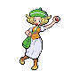

---

## Rival Bianca – 2

**Battle Type:** Single Battle

=== "Tepig"

    | Pokemon | Attributes | Moves |
    |:-------:|------------|-------|
    |  |**Lv. 9** [Meowth](../../pokemon/meowth.md/) **Item:** No Item **Ability:** Technician | 1. — 2. — 3. — 4. — |
    |  |**Lv. 10** [Snivy](../../pokemon/snivy.md/) **Item:** No Item **Ability:** Contrary | 1. — 2. — 3. — 4. — |
    

=== "Snivy"

    | Pokemon | Attributes | Moves |
    |:-------:|------------|-------|
    |  |**Lv. 9** [Meowth](../../pokemon/meowth.md/) **Item:** No Item **Ability:** Technician | 1. — 2. — 3. — 4. — |
    |  |**Lv. 10** [Oshawott](../../pokemon/oshawott.md/) **Item:** No Item **Ability:** Vital Spirit | 1. — 2. — 3. — 4. — |
    

=== "Oshawott"

    | Pokemon | Attributes | Moves |
    |:-------:|------------|-------|
    |  |**Lv. 9** [Meowth](../../pokemon/meowth.md/) **Item:** No Item **Ability:** Technician | 1. — 2. — 3. — 4. — |
    |  |**Lv. 10** [Tepig](../../pokemon/tepig.md/) **Item:** No Item **Ability:** Adaptability | 1. — 2. — 3. — 4. — |
    

