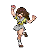

---

## Important Trainers

1. [Rival Bianca – 2](../important_trainers#rival-bianca-2)

---

## Generic Trainers</h3>

| Trainer | P1 | P2 | P3 | P4 | P5 | P6 |
|:-------:|:--:|:--:|:--:|:--:|:--:|:--:|
|  Youngster Jimmy |  [Hoothoot](../../pokemon/hoothoot.wild_md/) Lv. 7 |  [Wurmple](../../pokemon/wurmple.wild_md/) Lv. 7 |  [Patrat](../../pokemon/patrat.wild_md/) Lv. 7 |
|  Lass Mail |  [Zigzagoon](../../pokemon/zigzagoon.wild_md/) Lv. 7 |  [Meowth](../../pokemon/meowth.wild_md/) Lv. 7 |  [Pidgey](../../pokemon/pidgey.wild_md/) Lv. 7 |  [Caterpie](../../pokemon/caterpie.wild_md/) Lv. 7 |
|  Youngster Roland |  [Lillipup](../../pokemon/lillipup.wild_md/) Lv. 7 |  [Bidoof](../../pokemon/bidoof.wild_md/) Lv. 7 |  [Kricketot](../../pokemon/kricketot.wild_md/) Lv. 7 |  [Weedle](../../pokemon/weedle.wild_md/) Lv. 7 |

