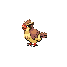

---

## Important Trainers

1. [Rival Bianca – 2](important_trainers.md#rival-bianca-2)

---

## Generic Trainers</h3>

| Trainer | P1 | P2 | P3 | P4 | P5 | P6 |
|:-------:|:--:|:--:|:--:|:--:|:--:|:--:|
|  Youngster Jimmy |  [Hoothoot](../../pokemon/hoothoot.md/) Lv. 7 |  [Wurmple](../../pokemon/wurmple.md/) Lv. 7 |  [Patrat](../../pokemon/patrat.md/) Lv. 7 |
|  Lass Mail |  [Zigzagoon](../../pokemon/zigzagoon.md/) Lv. 7 |  [Meowth](../../pokemon/meowth.md/) Lv. 7 |  [Pidgey](../../pokemon/pidgey.md/) Lv. 7 |  [Caterpie](../../pokemon/caterpie.md/) Lv. 7 |
|  Youngster Roland |  [Lillipup](../../pokemon/lillipup.md/) Lv. 7 |  [Bidoof](../../pokemon/bidoof.md/) Lv. 7 |  [Kricketot](../../pokemon/kricketot.md/) Lv. 7 |  [Weedle](../../pokemon/weedle.md/) Lv. 7 |

