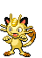

### Grass

| Sprite | Pokémon | Encounter Type | Chance |
| :---: | --- | :---: | --- |
|  | [Purrloin](../../pokemon/purrloin.md/) | {: style='max-width: 24px;' } | 20% |
|  | [Patrat](../../pokemon/patrat.md/) | {: style='max-width: 24px;' } | 20% |
|  | [Kricketot](../../pokemon/kricketot.md/) | {: style='max-width: 24px;' } | 10% |
|  | [Caterpie](../../pokemon/caterpie.md/) | {: style='max-width: 24px;' } | 10% |
|  | [Wurmple](../../pokemon/wurmple.md/) | {: style='max-width: 24px;' } | 10% |
|  | [Weedle](../../pokemon/weedle.md/) | {: style='max-width: 24px;' } | 10% |
|  | [Poochyena](../../pokemon/poochyena.md/) | {: style='max-width: 24px;' } | 5% |
|  | [Meowth](../../pokemon/meowth.md/) | {: style='max-width: 24px;' } | 5% |
|  | [Spearow](../../pokemon/spearow.md/) | {: style='max-width: 24px;' } | 5% |
|  | [Mankey](../../pokemon/mankey.md/) | {: style='max-width: 24px;' } | 5%

### Rustling Grass

| Sprite | Pokémon | Encounter Type | Chance |
| :---: | --- | :---: | --- |
|  | [Audino](../../pokemon/audino.md/) | {: style='max-width: 24px;' } | 60% |
|  | [Skitty](../../pokemon/skitty.md/) | {: style='max-width: 24px;' } | 10% |
|  | [Nincada](../../pokemon/nincada.md/) | {: style='max-width: 24px;' } | 10% |
|  | [Butterfree](../../pokemon/butterfree.md/) | {: style='max-width: 24px;' } | 5% |
|  | [Beedrill](../../pokemon/beedrill.md/) | {: style='max-width: 24px;' } | 5% |
|  | [Beautifly](../../pokemon/beautifly.md/) | {: style='max-width: 24px;' } | 5% |
|  | [Dustox](../../pokemon/dustox.md/) | {: style='max-width: 24px;' } | 5% |
