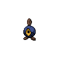

---

## Rival Cheren – 3

=== "Tepig"

    | Pokemon | Attributes | Moves |
    |:-------:|------------|-------|
    |  [Staravia](../../pokemon/staravia.md/) |**Level:** 14 **Item:** - **Ability:** Reckless | 1. — 2. — 3. — 4. — |
    |  [Roggenrola](../../pokemon/roggenrola.md/) |**Level:** 14 **Item:** - **Ability:** Sturdy | 1. — 2. — 3. — 4. — |
    |  [Pansear](../../pokemon/pansear.md/) |**Level:** 14 **Item:** - **Ability:** Torrent | 1. — 2. — 3. — 4. — |
    |  [Oshawott](../../pokemon/oshawott.md/) |**Level:** 16 **Item:** Sitrus Berry **Ability:** Contrary | 1. — 2. — 3. — 4. — |
    

=== "Snivy"

    | Pokemon | Attributes | Moves |
    |:-------:|------------|-------|
    |  [Staravia](../../pokemon/staravia.md/) |**Level:** 14 **Item:** - **Ability:** Reckless | 1. — 2. — 3. — 4. — |
    |  [Roggenrola](../../pokemon/roggenrola.md/) |**Level:** 14 **Item:** - **Ability:** Sturdy | 1. — 2. — 3. — 4. — |
    |  [Pansage](../../pokemon/pansage.md/) |**Level:** 14 **Item:** - **Ability:** Blaze | 1. — 2. — 3. — 4. — |
    |  [Tepig](../../pokemon/tepig.md/) |**Level:** 16 **Item:** Sitrus Berry **Ability:** Vital Spirit | 1. — 2. — 3. — 4. — |
    

=== "Oshawott"

    | Pokemon | Attributes | Moves |
    |:-------:|------------|-------|
    |  [Staravia](../../pokemon/staravia.md/) |**Level:** 14 **Item:** - **Ability:** Reckless | 1. — 2. — 3. — 4. — |
    |  [Roggenrola](../../pokemon/roggenrola.md/) |**Level:** 14 **Item:** - **Ability:** Sturdy | 1. — 2. — 3. — 4. — |
    |  [Panpour](../../pokemon/panpour.md/) |**Level:** 14 **Item:** - **Ability:** Overgrow | 1. — 2. — 3. — 4. — |
    |  [Snivy](../../pokemon/snivy.md/) |**Level:** 16 **Item:** Sitrus Berry **Ability:** Adaptability | 1. — 2. — 3. — 4. — |
    

