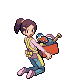
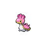
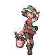
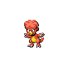

---

## Important Trainers

1. [Rival Cheren – 3](../important_trainers#rival-cheren-3)

---

## Generic Trainers</h3>

| Trainer | P1 | P2 | P3 | P4 | P5 | P6 |
|:-------:|:--:|:--:|:--:|:--:|:--:|:--:|
|  Twins Kumi & Amy D |  [Nidoran M](../../pokemon/nidoran-m.wild_md/) Lv. 14 |  [Nidoran F](../../pokemon/nidoran-f.wild_md/) Lv. 14 |
|  Nursery Aide Autumn |  [Togepi](../../pokemon/togepi.wild_md/) Lv. 14 |  [Natu](../../pokemon/natu.wild_md/) Lv. 14 |  [Ralts](../../pokemon/ralts.wild_md/) Lv. 14 |  [Munna](../../pokemon/munna.wild_md/) Lv. 14 |
|  Preschooler Doyle |  [Squirtle](../../pokemon/squirtle.wild_md/) Lv. 14 |  [Oshawott](../../pokemon/oshawott.wild_md/) Lv. 14 |
|  Preschooler Wendy |  [Totodile](../../pokemon/totodile.wild_md/) Lv. 14 |  [Piplup](../../pokemon/piplup.wild_md/) Lv. 14 |
|  Preschooler Tully |  [Mudkip](../../pokemon/mudkip.wild_md/) Lv. 14 |  [Psyduck](../../pokemon/psyduck.wild_md/) Lv. 14 |  [Shellos](../../pokemon/shellos.wild_md/) Lv. 14 |
|  PKMN Breeder Adelaide |  [Igglybuff](../../pokemon/igglybuff.wild_md/) Lv. 12 |  [Cleffa](../../pokemon/cleffa.wild_md/) Lv. 12 |  [Pichu](../../pokemon/pichu.wild_md/) Lv. 12 |  [Magby](../../pokemon/magby.wild_md/) Lv. 12 |  [Elekid](../../pokemon/elekid.wild_md/) Lv. 12 |  [Smoochum](../../pokemon/smoochum.wild_md/) Lv. 12 |
|  School Kid Al |  [Blitzle](../../pokemon/blitzle.wild_md/) Lv. 15 |  [Mareep](../../pokemon/mareep.wild_md/) Lv. 15 |  [Flaaffy](../../pokemon/flaaffy.wild_md/) Lv. 15 |
|  School Kid Marsha |  [Phanpy](../../pokemon/phanpy.wild_md/) Lv. 15 |  [Teddiursa](../../pokemon/teddiursa.wild_md/) Lv. 15 |  [Woobat](../../pokemon/woobat.wild_md/) Lv. 15 |  [Whismur](../../pokemon/whismur.wild_md/) Lv. 15 |
|  School Kid Gina |  [Wooper](../../pokemon/wooper.wild_md/) Lv. 16 |  [Taillow](../../pokemon/taillow.wild_md/) Lv. 16 |  [Lotad](../../pokemon/lotad.wild_md/) Lv. 16 |  [Seedot](../../pokemon/seedot.wild_md/) Lv. 16 |
|  School Kid Edgar |  [Shinx](../../pokemon/shinx.wild_md/) Lv. 16 |  [Luxio](../../pokemon/luxio.wild_md/) Lv. 16 |  [Nuzleaf](../../pokemon/nuzleaf.wild_md/) Lv. 16 |  [Lombre](../../pokemon/lombre.wild_md/) Lv. 16 |
|  PKMN Breeder Galen |  [Serperior](../../pokemon/serperior.wild_md/) Lv. 50 |  [Samurott](../../pokemon/samurott.wild_md/) Lv. 50 |  [Emboar](../../pokemon/emboar.wild_md/) Lv. 50 |

