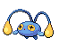

### Grass

| Sprite | Pokémon | Encounter Type | Chance |
| :---: | --- | :---: | --- |
|  | [Mareep](../../pokemon/mareep.md/) | {: style='max-width: 24px;' } | 20% |
|  | [Taillow](../../pokemon/taillow.md/) | {: style='max-width: 24px;' } | 20% |
|  | [Shellos](../../pokemon/shellos.md/) | {: style='max-width: 24px;' } | 10% |
|  | [Sunkern](../../pokemon/sunkern.md/) | {: style='max-width: 24px;' } | 10% |
|  | [Lotad](../../pokemon/lotad.md/) | {: style='max-width: 24px;' } | 10% |
|  | [Seedot](../../pokemon/seedot.md/) | {: style='max-width: 24px;' } | 10% |
|  | [Shinx](../../pokemon/shinx.md/) | {: style='max-width: 24px;' } | 10% |
|  | [Abra](../../pokemon/abra.md/) | {: style='max-width: 24px;' } | 5% |
|  | [Phanpy](../../pokemon/phanpy.md/) | {: style='max-width: 24px;' } | 5%

### Dark Grass

| Sprite | Pokémon | Encounter Type | Chance |
| :---: | --- | :---: | --- |
|  | [Blitzle](../../pokemon/blitzle.md/) | {: style='max-width: 24px;' } | 20% |
|  | [Pidove](../../pokemon/pidove.md/) | {: style='max-width: 24px;' } | 20% |
|  | [Growlithe](../../pokemon/growlithe.md/) | {: style='max-width: 24px;' } | 10% |
|  | [Vulpix](../../pokemon/vulpix.md/) | {: style='max-width: 24px;' } | 10% |
|  | [Hoppip](../../pokemon/hoppip.md/) | {: style='max-width: 24px;' } | 10% |
|  | [Budew](../../pokemon/budew.md/) | {: style='max-width: 24px;' } | 10% |
|  | [Marill](../../pokemon/marill.md/) | {: style='max-width: 24px;' } | 5% |
|  | [Houndour](../../pokemon/houndour.md/) | {: style='max-width: 24px;' } | 5% |
|  | [Volbeat](../../pokemon/volbeat.md/) | {: style='max-width: 24px;' } | 4% |
|  | [Illumise](../../pokemon/illumise.md/) | {: style='max-width: 24px;' } | 4% |
|  | [Lombre](../../pokemon/lombre.md/) | {: style='max-width: 24px;' } | 1% |
|  | [Nuzleaf](../../pokemon/nuzleaf.md/) | {: style='max-width: 24px;' } | 1%

### Rustling Grass

| Sprite | Pokémon | Encounter Type | Chance |
| :---: | --- | :---: | --- |
|  | [Audino](../../pokemon/audino.md/) | {: style='max-width: 24px;' } | 70% |
|  | [Oshawott](../../pokemon/oshawott.md/) | {: style='max-width: 24px;' } | 10% |
|  | [Squirtle](../../pokemon/squirtle.md/) | {: style='max-width: 24px;' } | 5% |
|  | [Totodile](../../pokemon/totodile.md/) | {: style='max-width: 24px;' } | 5% |
|  | [Mudkip](../../pokemon/mudkip.md/) | {: style='max-width: 24px;' } | 5% |
|  | [Piplup](../../pokemon/piplup.md/) | {: style='max-width: 24px;' } | 5%

### Surfing

| Sprite | Pokémon | Encounter Type | Chance |
| :---: | --- | :---: | --- |
|  | [Slowpoke](../../pokemon/slowpoke.md/) | {: style='max-width: 24px;' } | 60% |
|  | [Psyduck](../../pokemon/psyduck.md/) | {: style='max-width: 24px;' } | 30% |
|  | [Marill](../../pokemon/marill.md/) | {: style='max-width: 24px;' } | 10%

### Rippling Surfing

| Sprite | Pokémon | Encounter Type | Chance |
| :---: | --- | :---: | --- |
|  | [Golduck](../../pokemon/golduck.md/) | {: style='max-width: 24px;' } | 60% |
|  | [Azumarill](../../pokemon/azumarill.md/) | {: style='max-width: 24px;' } | 30% |
|  | [Slowbro](../../pokemon/slowbro.md/) | {: style='max-width: 24px;' } | 5% |
|  | [Slowking](../../pokemon/slowking.md/) | {: style='max-width: 24px;' } | 5%

### Fishing

| Sprite | Pokémon | Encounter Type | Chance |
| :---: | --- | :---: | --- |
|  | [Poliwag](../../pokemon/poliwag.md/) | {: style='max-width: 24px;' } | 60% |
|  | [Slowpoke](../../pokemon/slowpoke.md/) | {: style='max-width: 24px;' } | 30% |
|  | [Chinchou](../../pokemon/chinchou.md/) | {: style='max-width: 24px;' } | 5% |
|  | [Remoraid](../../pokemon/remoraid.md/) | {: style='max-width: 24px;' } | 5%

### Rippling Fishing

| Sprite | Pokémon | Encounter Type | Chance |
| :---: | --- | :---: | --- |
|  | [Chinchou](../../pokemon/chinchou.md/) | {: style='max-width: 24px;' } | 60% |
|  | [Qwilfish](../../pokemon/qwilfish.md/) | {: style='max-width: 24px;' } | 30% |
|  | [Remoraid](../../pokemon/remoraid.md/) | {: style='max-width: 24px;' } | 10% |
