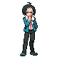

# Route 4 – Important Trainers

---

## Rival Bianca – 3

**Battle Type:** Double Battle

=== "Tepig"

    | Pokémon | Attributes | Item | Moves |
    |:-------:|------------|:----:|-------|
    |  | **Lv. 29** [Munna](../../pokemon/munna.md/) **Ability:** Analytic {: width="48"} | No Item | 1. — 2. — 3. — 4. — |
    |  | **Lv. 31** [Persian](../../pokemon/persian.md/) **Ability:** Technician {: width="48"} | No Item | 1. — 2. — 3. — 4. — |
    |  | **Lv. 29** [Simipour](../../pokemon/simipour.md/) **Ability:** Unburden {: width="48"} | No Item | 1. — 2. — 3. — 4. — |
    |  | **Lv. 31** [Servine](../../pokemon/servine.md/) **Ability:** Contrary {: width="48"} |  Sitrus Berry | 1. — 2. — 3. — 4. — |
    

=== "Snivy"

    | Pokémon | Attributes | Item | Moves |
    |:-------:|------------|:----:|-------|
    |  | **Lv. 29** [Munna](../../pokemon/munna.md/) **Ability:** Analytic {: width="48"} | No Item | 1. — 2. — 3. — 4. — |
    |  | **Lv. 31** [Persian](../../pokemon/persian.md/) **Ability:** Technician {: width="48"} | No Item | 1. — 2. — 3. — 4. — |
    |  | **Lv. 29** [Simisear](../../pokemon/simisear.md/) **Ability:** Technician {: width="48"} | No Item | 1. — 2. — 3. — 4. — |
    |  | **Lv. 31** [Dewott](../../pokemon/dewott.md/) **Ability:** Vital Spirit {: width="48"} {: width="48"} |  Sitrus Berry | 1. — 2. — 3. — 4. — |
    

=== "Oshawott"

    | Pokémon | Attributes | Item | Moves |
    |:-------:|------------|:----:|-------|
    |  | **Lv. 29** [Munna](../../pokemon/munna.md/) **Ability:** Analytic {: width="48"} | No Item | 1. — 2. — 3. — 4. — |
    |  | **Lv. 31** [Persian](../../pokemon/persian.md/) **Ability:** Technician {: width="48"} | No Item | 1. — 2. — 3. — 4. — |
    |  | **Lv. 29** [Simisage](../../pokemon/simisage.md/) **Ability:** Technician {: width="48"} | No Item | 1. — 2. — 3. — 4. — |
    |  | **Lv. 31** [Pignite](../../pokemon/pignite.md/) **Ability:** Adaptability {: width="48"} {: width="48"} |  Sitrus Berry | 1. — 2. — 3. — 4. — |
    

---

## Rival Cheren – 4

**Battle Type:** Rotation Battle

=== "Tepig"

    | Pokémon | Attributes | Item | Moves |
    |:-------:|------------|:----:|-------|
    |  | **Lv. 31** [Staravia](../../pokemon/staravia.md/) **Ability:** Reckless {: width="48"} {: width="48"} |  Sharp Beak | 1. — 2. — 3. — 4. — |
    |  | **Lv. 31** [Boldore](../../pokemon/boldore.md/) **Ability:** Sturdy {: width="48"} |  Hard Stone | 1. — 2. — 3. — 4. — |
    |  | **Lv. 31** [Kadabra](../../pokemon/kadabra.md/) **Ability:** Magic Guard {: width="48"} |  Twisted Spoon | 1. — 2. — 3. — 4. — |
    |  | **Lv. 31** [Simisear](../../pokemon/simisear.md/) **Ability:** Torrent {: width="48"} |  Expert Belt | 1. — 2. — 3. — 4. — |
    |  | **Lv. 33** [Dewott](../../pokemon/dewott.md/) **Ability:** Contrary {: width="48"} {: width="48"} |  Sitrus Berry | 1. — 2. — 3. — 4. — |
    

=== "Snivy"

    | Pokémon | Attributes | Item | Moves |
    |:-------:|------------|:----:|-------|
    |  | **Lv. 31** [Staravia](../../pokemon/staravia.md/) **Ability:** Reckless {: width="48"} {: width="48"} |  Sharp Beak | 1. — 2. — 3. — 4. — |
    |  | **Lv. 31** [Boldore](../../pokemon/boldore.md/) **Ability:** Sturdy {: width="48"} |  Hard Stone | 1. — 2. — 3. — 4. — |
    |  | **Lv. 31** [Kadabra](../../pokemon/kadabra.md/) **Ability:** Magic Guard {: width="48"} |  Twisted Spoon | 1. — 2. — 3. — 4. — |
    |  | **Lv. 31** [Simisage](../../pokemon/simisage.md/) **Ability:** Blaze {: width="48"} |  Expert Belt | 1. — 2. — 3. — 4. — |
    |  | **Lv. 33** [Pignite](../../pokemon/pignite.md/) **Ability:** ? {: width="48"} {: width="48"} |  Sitrus Berry | 1. — 2. — 3. — 4. — |
    

=== "Oshawott"

    | Pokémon | Attributes | Item | Moves |
    |:-------:|------------|:----:|-------|
    |  | **Lv. 31** [Staravia](../../pokemon/staravia.md/) **Ability:** Reckless {: width="48"} {: width="48"} |  Sharp Beak | 1. — 2. — 3. — 4. — |
    |  | **Lv. 31** [Boldore](../../pokemon/boldore.md/) **Ability:** Sturdy {: width="48"} |  Hard Stone | 1. — 2. — 3. — 4. — |
    |  | **Lv. 31** [Kadabra](../../pokemon/kadabra.md/) **Ability:** Magic Guard {: width="48"} |  Twisted Spoon | 1. — 2. — 3. — 4. — |
    |  | **Lv. 31** [Simipour](../../pokemon/simipour.md/) **Ability:** Overgrow {: width="48"} |  Expert Belt | 1. — 2. — 3. — 4. — |
    |  | **Lv. 33** [Servine](../../pokemon/servine.md/) **Ability:** ? {: width="48"} |  Sitrus Berry | 1. — 2. — 3. — 4. — |
    

