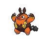

---

## Rival Bianca – 3

**Battle Type:** Double Battle

=== "Tepig"

    | Pokemon | Attributes | Moves |
    |:-------:|------------|-------|
    |  |**Lv. 29** [Munna](../../pokemon/munna.md/) **Item:** No Item **Ability:** Analytic | 1. — 2. — 3. — 4. — |
    |  |**Lv. 31** [Persian](../../pokemon/persian.md/) **Item:** No Item **Ability:** Technician | 1. — 2. — 3. — 4. — |
    |  |**Lv. 29** [Simipour](../../pokemon/simipour.md/) **Item:** No Item **Ability:** Unburden | 1. — 2. — 3. — 4. — |
    |  |**Lv. 31** [Servine](../../pokemon/servine.md/) **Item:** Sitrus Berry **Ability:** Contrary | 1. — 2. — 3. — 4. — |
    

=== "Snivy"

    | Pokemon | Attributes | Moves |
    |:-------:|------------|-------|
    |  |**Lv. 29** [Munna](../../pokemon/munna.md/) **Item:** No Item **Ability:** Analytic | 1. — 2. — 3. — 4. — |
    |  |**Lv. 31** [Persian](../../pokemon/persian.md/) **Item:** No Item **Ability:** Technician | 1. — 2. — 3. — 4. — |
    |  |**Lv. 29** [Simisear](../../pokemon/simisear.md/) **Item:** No Item **Ability:** Technician | 1. — 2. — 3. — 4. — |
    |  |**Lv. 31** [Dewott](../../pokemon/dewott.md/) **Item:** Sitrus Berry **Ability:** Vital Spirit | 1. — 2. — 3. — 4. — |
    

=== "Oshawott"

    | Pokemon | Attributes | Moves |
    |:-------:|------------|-------|
    |  |**Lv. 29** [Munna](../../pokemon/munna.md/) **Item:** No Item **Ability:** Analytic | 1. — 2. — 3. — 4. — |
    |  |**Lv. 31** [Persian](../../pokemon/persian.md/) **Item:** No Item **Ability:** Technician | 1. — 2. — 3. — 4. — |
    |  |**Lv. 29** [Simisage](../../pokemon/simisage.md/) **Item:** No Item **Ability:** Technician | 1. — 2. — 3. — 4. — |
    |  |**Lv. 31** [Pignite](../../pokemon/pignite.md/) **Item:** Sitrus Berry **Ability:** Adaptability | 1. — 2. — 3. — 4. — |
    

---

## Rival Cheren – 4

**Battle Type:** Rotation Battle

=== "Tepig"

    | Pokemon | Attributes | Moves |
    |:-------:|------------|-------|
    |  |**Lv. 31** [Staravia](../../pokemon/staravia.md/) **Item:** Sharp Beak **Ability:** Reckless | 1. — 2. — 3. — 4. — |
    |  |**Lv. 31** [Boldore](../../pokemon/boldore.md/) **Item:** Hard Stone **Ability:** Sturdy | 1. — 2. — 3. — 4. — |
    |  |**Lv. 31** [Kadabra](../../pokemon/kadabra.md/) **Item:** Twisted Spoon **Ability:** Magic Guard | 1. — 2. — 3. — 4. — |
    |  |**Lv. 31** [Simisear](../../pokemon/simisear.md/) **Item:** Expert Belt **Ability:** Torrent | 1. — 2. — 3. — 4. — |
    |  |**Lv. 33** [Dewott](../../pokemon/dewott.md/) **Item:** Sitrus Berry **Ability:** Contrary | 1. — 2. — 3. — 4. — |
    

=== "Snivy"

    | Pokemon | Attributes | Moves |
    |:-------:|------------|-------|
    |  |**Lv. 31** [Staravia](../../pokemon/staravia.md/) **Item:** Sharp Beak **Ability:** Reckless | 1. — 2. — 3. — 4. — |
    |  |**Lv. 31** [Boldore](../../pokemon/boldore.md/) **Item:** Hard Stone **Ability:** Sturdy | 1. — 2. — 3. — 4. — |
    |  |**Lv. 31** [Kadabra](../../pokemon/kadabra.md/) **Item:** Twisted Spoon **Ability:** Magic Guard | 1. — 2. — 3. — 4. — |
    |  |**Lv. 31** [Simisage](../../pokemon/simisage.md/) **Item:** Expert Belt **Ability:** Blaze | 1. — 2. — 3. — 4. — |
    |  |**Lv. 33** [Pignite](../../pokemon/pignite.md/) **Item:** Sitrus Berry **Ability:** ?1. — 2. — 3. — 4. — |
    

=== "Oshawott"

    | Pokemon | Attributes | Moves |
    |:-------:|------------|-------|
    |  |**Lv. 31** [Staravia](../../pokemon/staravia.md/) **Item:** Sharp Beak **Ability:** Reckless | 1. — 2. — 3. — 4. — |
    |  |**Lv. 31** [Boldore](../../pokemon/boldore.md/) **Item:** Hard Stone **Ability:** Sturdy | 1. — 2. — 3. — 4. — |
    |  |**Lv. 31** [Kadabra](../../pokemon/kadabra.md/) **Item:** Twisted Spoon **Ability:** Magic Guard | 1. — 2. — 3. — 4. — |
    |  |**Lv. 31** [Simipour](../../pokemon/simipour.md/) **Item:** Expert Belt **Ability:** Overgrow | 1. — 2. — 3. — 4. — |
    |  |**Lv. 33** [Servine](../../pokemon/servine.md/) **Item:** Sitrus Berry **Ability:** ?1. — 2. — 3. — 4. — |
    

