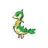

---

## Rival Bianca – 3

**Battle Type:** Double Battle

=== "Tepig"

    | Pokemon | Attributes | Moves |
    |:-------:|------------|-------|
    |  |**Lv. 29** [Munna](../../pokemon/munna.md/) **Item:** No Item **Ability:** Analytic |  1. — 2. — 3. — 4. — |
    |  |**Lv. 31** [Persian](../../pokemon/persian.md/) **Item:** No Item **Ability:** Technician |  1. — 2. — 3. — 4. — |
    |  |**Lv. 29** [Simipour](../../pokemon/simipour.md/) **Item:** No Item **Ability:** Unburden |  1. — 2. — 3. — 4. — |
    |  |**Lv. 31** [Servine](../../pokemon/servine.md/) **Item:** Sitrus Berry  **Ability:** Contrary |  1. — 2. — 3. — 4. — |
    

=== "Snivy"

    | Pokemon | Attributes | Moves |
    |:-------:|------------|-------|
    |  |**Lv. 29** [Munna](../../pokemon/munna.md/) **Item:** No Item **Ability:** Analytic |  1. — 2. — 3. — 4. — |
    |  |**Lv. 31** [Persian](../../pokemon/persian.md/) **Item:** No Item **Ability:** Technician |  1. — 2. — 3. — 4. — |
    |  |**Lv. 29** [Simisear](../../pokemon/simisear.md/) **Item:** No Item **Ability:** Technician |  1. — 2. — 3. — 4. — |
    |  |**Lv. 31** [Dewott](../../pokemon/dewott.md/) **Item:** Sitrus Berry  **Ability:** Vital Spirit |  1. — 2. — 3. — 4. — |
    

=== "Oshawott"

    | Pokemon | Attributes | Moves |
    |:-------:|------------|-------|
    |  |**Lv. 29** [Munna](../../pokemon/munna.md/) **Item:** No Item **Ability:** Analytic |  1. — 2. — 3. — 4. — |
    |  |**Lv. 31** [Persian](../../pokemon/persian.md/) **Item:** No Item **Ability:** Technician |  1. — 2. — 3. — 4. — |
    |  |**Lv. 29** [Simisage](../../pokemon/simisage.md/) **Item:** No Item **Ability:** Technician |  1. — 2. — 3. — 4. — |
    |  |**Lv. 31** [Pignite](../../pokemon/pignite.md/) **Item:** Sitrus Berry  **Ability:** Adaptability |  1. — 2. — 3. — 4. — |
    

---

## Rival Cheren – 4

**Battle Type:** Rotation Battle

=== "Tepig"

    | Pokemon | Attributes | Moves |
    |:-------:|------------|-------|
    |  |**Lv. 31** [Staravia](../../pokemon/staravia.md/) **Item:** Sharp Beak  **Ability:** Reckless |  1. — 2. — 3. — 4. — |
    |  |**Lv. 31** [Boldore](../../pokemon/boldore.md/) **Item:** Hard Stone  **Ability:** Sturdy |  1. — 2. — 3. — 4. — |
    |  |**Lv. 31** [Kadabra](../../pokemon/kadabra.md/) **Item:** Twisted Spoon  **Ability:** Magic Guard |  1. — 2. — 3. — 4. — |
    |  |**Lv. 31** [Simisear](../../pokemon/simisear.md/) **Item:** Expert Belt  **Ability:** Torrent |  1. — 2. — 3. — 4. — |
    |  |**Lv. 33** [Dewott](../../pokemon/dewott.md/) **Item:** Sitrus Berry  **Ability:** Contrary |  1. — 2. — 3. — 4. — |
    

=== "Snivy"

    | Pokemon | Attributes | Moves |
    |:-------:|------------|-------|
    |  |**Lv. 31** [Staravia](../../pokemon/staravia.md/) **Item:** Sharp Beak  **Ability:** Reckless |  1. — 2. — 3. — 4. — |
    |  |**Lv. 31** [Boldore](../../pokemon/boldore.md/) **Item:** Hard Stone  **Ability:** Sturdy |  1. — 2. — 3. — 4. — |
    |  |**Lv. 31** [Kadabra](../../pokemon/kadabra.md/) **Item:** Twisted Spoon  **Ability:** Magic Guard |  1. — 2. — 3. — 4. — |
    |  |**Lv. 31** [Simisage](../../pokemon/simisage.md/) **Item:** Expert Belt  **Ability:** Blaze |  1. — 2. — 3. — 4. — |
    |  |**Lv. 33** [Pignite](../../pokemon/pignite.md/) **Item:** Sitrus Berry  **Ability:** ? 1. — 2. — 3. — 4. — |
    

=== "Oshawott"

    | Pokemon | Attributes | Moves |
    |:-------:|------------|-------|
    |  |**Lv. 31** [Staravia](../../pokemon/staravia.md/) **Item:** Sharp Beak  **Ability:** Reckless |  1. — 2. — 3. — 4. — |
    |  |**Lv. 31** [Boldore](../../pokemon/boldore.md/) **Item:** Hard Stone  **Ability:** Sturdy |  1. — 2. — 3. — 4. — |
    |  |**Lv. 31** [Kadabra](../../pokemon/kadabra.md/) **Item:** Twisted Spoon  **Ability:** Magic Guard |  1. — 2. — 3. — 4. — |
    |  |**Lv. 31** [Simipour](../../pokemon/simipour.md/) **Item:** Expert Belt  **Ability:** Overgrow |  1. — 2. — 3. — 4. — |
    |  |**Lv. 33** [Servine](../../pokemon/servine.md/) **Item:** Sitrus Berry  **Ability:** ? 1. — 2. — 3. — 4. — |
    

