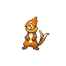
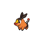
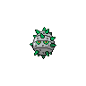
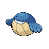
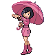

# Route 4 – Trainer Rosters

---

## Important Trainers

1. [Rival Bianca – 3](important_trainers.md#rival-bianca-3)
2. [Rival Cheren – 4](important_trainers.md#rival-cheren-4)

---

## Generic Trainers</h3>

| Trainer | P1 | P2 | P3 | P4 | P5 | P6 |
|:-------:|:--:|:--:|:--:|:--:|:--:|:--:|
|  Backpacker Keane |  [Sandshrew](../../pokemon/sandshrew.md/) Lv. 27 |  [Exeggcute](../../pokemon/exeggcute.md/) Lv. 27 |  [Diglett](../../pokemon/diglett.md/) Lv. 27 |  [Sunkern](../../pokemon/sunkern.md/) Lv. 27 |  [Swablu](../../pokemon/swablu.md/) Lv. 27 |
|  Worker Gus |  [Makuhita](../../pokemon/makuhita.md/) Lv. 25 |  [Baltoy](../../pokemon/baltoy.md/) Lv. 25 |  [Swinub](../../pokemon/swinub.md/) Lv. 25 |  [Cranidos](../../pokemon/cranidos.md/) Lv. 25 |
|  Backpacker Anna |  [Wingull](../../pokemon/wingull.md/) Lv. 27 |  [Eevee](../../pokemon/eevee.md/) Lv. 27 |  [Spearow](../../pokemon/spearow.md/) Lv. 27 |  [Electrike](../../pokemon/electrike.md/) Lv. 27 |  [Buizel](../../pokemon/buizel.md/) Lv. 27 |
|  Backpacker Jill |  [Cherubi](../../pokemon/cherubi.md/) Lv. 27 |  [Snivy](../../pokemon/snivy.md/) Lv. 27 |  [Pidove](../../pokemon/pidove.md/) Lv. 27 |  [Darumaka](../../pokemon/darumaka.md/) Lv. 27 |  [Deerling](../../pokemon/deerling.md/) Lv. 27 |
|  Backpacker Waylon |  [Tepig](../../pokemon/tepig.md/) Lv. 27 |  [Ducklett](../../pokemon/ducklett.md/) Lv. 27 |  [Vanillite](../../pokemon/vanillite.md/) Lv. 27 |  [Ferroseed](../../pokemon/ferroseed.md/) Lv. 27 |  [Mienfoo](../../pokemon/mienfoo.md/) Lv. 27 |
|  Worker Scott |  [Boldore](../../pokemon/boldore.md/) Lv. 26 |  [Graveler](../../pokemon/graveler.md/) Lv. 26 |  [Hippopotas](../../pokemon/hippopotas.md/) Lv. 26 |
|  Worker Zack |  [Rhyhorn](../../pokemon/rhyhorn.md/) Lv. 27 |  [Sandslash](../../pokemon/sandslash.md/) Lv. 27 |
|  Backpacker Jerome |  [Lileep](../../pokemon/lileep.md/) Lv. 28 |  [Snorunt](../../pokemon/snorunt.md/) Lv. 28 |  [Spheal](../../pokemon/spheal.md/) Lv. 28 |
|  Worker Shelby |  [Machoke](../../pokemon/machoke.md/) Lv. 28 |
|  Fisherman Hubert |  [Omanyte](../../pokemon/omanyte.md/) Lv. 26 |  [Remoraid](../../pokemon/remoraid.md/) Lv. 26 |  [Magikarp](../../pokemon/magikarp.md/) Lv. 26 |  [Horsea](../../pokemon/horsea.md/) Lv. 26 |  [Wailmer](../../pokemon/wailmer.md/) Lv. 26 |
|  Fisherman Andrew |  [Kabuto](../../pokemon/kabuto.md/) Lv. 26 |  [Finneon](../../pokemon/finneon.md/) Lv. 26 |  [Frillish](../../pokemon/frillish.md/) Lv. 26 |  [Chinchou](../../pokemon/chinchou.md/) Lv. 26 |  [Feebas](../../pokemon/feebas.md/) Lv. 26 |
|  Parasol Lady April |  [Mantyke](../../pokemon/mantyke.md/) Lv. 26 |  [Munchlax](../../pokemon/munchlax.md/) Lv. 26 |  [Snover](../../pokemon/snover.md/) Lv. 26 |  [Shieldon](../../pokemon/shieldon.md/) Lv. 26 |

