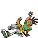

---

## Important Trainers

1. [Rival Cheren – 5](../important_trainers#rival-cheren-5)

---

## Generic Trainers</h3>

| Trainer | P1 | P2 | P3 | P4 | P5 | P6 |
|:-------:|:--:|:--:|:--:|:--:|:--:|:--:|
|  Preschooler Sarah |  [Lunatone](../../pokemon/lunatone.wild_md/) Lv. 35 |
|  Preschooler Billy |  [Solrock](../../pokemon/solrock.wild_md/) Lv. 35 |
|  Baker Jenn |  [Combee](../../pokemon/combee.wild_md/) Lv. 33 |  [Munchlax](../../pokemon/munchlax.wild_md/) Lv. 33 |
|  Harlequin Paul |  [Palpitoad](../../pokemon/palpitoad.wild_md/) Lv. 32 |  [Seel](../../pokemon/seel.wild_md/) Lv. 32 |
|  Musician Preston |  [Wigglytuff](../../pokemon/wigglytuff.wild_md/) Lv. 33 |
|  Dancer Brian |  [Kirlia](../../pokemon/kirlia.wild_md/) Lv. 33 |  [Ludicolo](../../pokemon/ludicolo.wild_md/) Lv. 33 |
|  Artist Horton |  [Smeargle](../../pokemon/smeargle.wild_md/) Lv. 31 |  [Smeargle](../../pokemon/smeargle.wild_md/) Lv. 31 |  [Smeargle](../../pokemon/smeargle.wild_md/) Lv. 31 |
|  Backpacker Michael |  [Nosepass](../../pokemon/nosepass.wild_md/) Lv. 33 |
|  Backpacker Lois |  [Shiftry](../../pokemon/shiftry.wild_md/) Lv. 33 |

