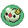
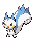

### Grass

| Sprite | Pokémon | Encounter Type | Chance |
| :---: | --- | :---: | --- |
|  | [Solosis](../../pokemon/solosis.md/) | {: style='max-width: 24px;' } | 20% |
|  | [Gothita](../../pokemon/gothita.md/) | {: style='max-width: 24px;' } | 20% |
|  | [Koffing](../../pokemon/koffing.md/) | {: style='max-width: 24px;' } | 10% |
|  | [Trubbish](../../pokemon/trubbish.md/) | {: style='max-width: 24px;' } | 10% |
|  | [Gulpin](../../pokemon/gulpin.md/) | {: style='max-width: 24px;' } | 10% |
|  | [Grimer](../../pokemon/grimer.md/) | {: style='max-width: 24px;' } | 10% |
|  | [Ditto](../../pokemon/ditto.md/) | {: style='max-width: 24px;' } | 5% |
|  | [Mime Jr.](../../pokemon/mime-jr.md/) | {: style='max-width: 24px;' } | 5% |
|  | [Bonsly](../../pokemon/bonsly.md/) | {: style='max-width: 24px;' } | 5% |
|  | [Pachirisu](../../pokemon/pachirisu.md/) | {: style='max-width: 24px;' } | 5%

### Dark Grass

| Sprite | Pokémon | Encounter Type | Chance |
| :---: | --- | :---: | --- |
|  | [Nidorina](../../pokemon/nidorina.md/) | {: style='max-width: 24px;' } | 20% |
|  | [Nidorino](../../pokemon/nidorino.md/) | {: style='max-width: 24px;' } | 20% |
|  | [Rufflet](../../pokemon/rufflet.md/) | {: style='max-width: 24px;' } | 10% |
|  | [Lickitung](../../pokemon/lickitung.md/) | {: style='max-width: 24px;' } | 10% |
|  | [Smeargle](../../pokemon/smeargle.md/) | {: style='max-width: 24px;' } | 10% |
|  | [Minccino](../../pokemon/minccino.md/) | {: style='max-width: 24px;' } | 10% |
|  | [Miltank](../../pokemon/miltank.md/) | {: style='max-width: 24px;' } | 5% |
|  | [Tauros](../../pokemon/tauros.md/) | {: style='max-width: 24px;' } | 5% |
|  | [Bagon](../../pokemon/bagon.md/) | {: style='max-width: 24px;' } | 5% |
|  | [Munchlax](../../pokemon/munchlax.md/) | {: style='max-width: 24px;' } | 5%

### Rustling Grass

| Sprite | Pokémon | Encounter Type | Chance |
| :---: | --- | :---: | --- |
|  | [Audino](../../pokemon/audino.md/) | {: style='max-width: 24px;' } | 40% |
|  | [Emolga](../../pokemon/emolga.md/) | {: style='max-width: 24px;' } | 20% |
|  | [Cinccino](../../pokemon/cinccino.md/) | {: style='max-width: 24px;' } | 10% |
|  | [Nidoqueen](../../pokemon/nidoqueen.md/) | {: style='max-width: 24px;' } | 10% |
|  | [Nidoking](../../pokemon/nidoking.md/) | {: style='max-width: 24px;' } | 10% |
|  | [Braviary](../../pokemon/braviary.md/) | {: style='max-width: 24px;' } | 10% |
