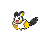
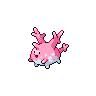

---

## Generic Trainers</h3>

| Trainer | P1 | P2 | P3 | P4 | P5 | P6 |
|:-------:|:--:|:--:|:--:|:--:|:--:|:--:|
|  Scientist William |  [Sawsbuck](../../pokemon/sawsbuck.wild_md/) Lv. 36 |
|  PKMN Ranger Shanti |  [Emolga](../../pokemon/emolga.wild_md/) Lv. 35 |  [Whimsicott](../../pokemon/whimsicott.wild_md/) Lv. 35 |
|  Parasol Lady Nicole |  [Lilligant](../../pokemon/lilligant.wild_md/) Lv. 34 |  [Alomomola](../../pokemon/alomomola.wild_md/) Lv. 34 |  [Jumpluff](../../pokemon/jumpluff.wild_md/) Lv. 34 |
|  Scientist Ron |  [Magneton](../../pokemon/magneton.wild_md/) Lv. 34 |  [Electrode](../../pokemon/electrode.wild_md/) Lv. 34 |  [Politoed](../../pokemon/politoed.wild_md/) Lv. 34 |
|  Scientist Maria |  [Gastrodon](../../pokemon/gastrodon.wild_md/) Lv. 34 |  [Ninetales](../../pokemon/ninetales.wild_md/) Lv. 34 |  [Parasect](../../pokemon/parasect.wild_md/) Lv. 34 |
|  Parasol Lady Tihana |  [Corsola](../../pokemon/corsola.wild_md/) Lv. 34 |  [Tropius](../../pokemon/tropius.wild_md/) Lv. 34 |  [Milotic](../../pokemon/milotic.wild_md/) Lv. 34 |
|  PKMN Ranger Richard |  [Pignite](../../pokemon/pignite.wild_md/) Lv. 34 |  [Sealeo](../../pokemon/sealeo.wild_md/) Lv. 34 |  [Leavanny](../../pokemon/leavanny.wild_md/) Lv. 34 |

