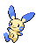
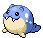

---

## Route 6 – Spring / Summer / A

### Grass

| Sprite | Pokémon | Encounter Type | Chance |
| :---: | --- | :---: | --- |
|  | [Cherubi](../../pokemon/cherubi.md/) | {: style='max-width: 24px;' } | 20% |
|  | [Deerling](../../pokemon/deerling.md/) | {: style='max-width: 24px;' } | 20% |
|  | [Stantler](../../pokemon/stantler.md/) | {: style='max-width: 24px;' } | 10% |
|  | [Foongus](../../pokemon/foongus.md/) | {: style='max-width: 24px;' } | 10% |
|  | [Pidgeotto](../../pokemon/pidgeotto.md/) | {: style='max-width: 24px;' } | 10% |
|  | [Natu](../../pokemon/natu.md/) | {: style='max-width: 24px;' } | 10% |
|  | [Mime Jr.](../../pokemon/mime-jr.md/) | {: style='max-width: 24px;' } | 5% |
|  | [Bonsly](../../pokemon/bonsly.md/) | {: style='max-width: 24px;' } | 5% |
|  | [Plusle](../../pokemon/plusle.md/) | {: style='max-width: 24px;' } | 5% |
|  | [Minun](../../pokemon/minun.md/) | {: style='max-width: 24px;' } | 5%

### Dark Grass

| Sprite | Pokémon | Encounter Type | Chance |
| :---: | --- | :---: | --- |
|  | [Cherrim](../../pokemon/cherrim.md/) | {: style='max-width: 24px;' } | 20% |
|  | [Sawsbuck](../../pokemon/sawsbuck.md/) | {: style='max-width: 24px;' } | 20% |
|  | [Stantler](../../pokemon/stantler.md/) | {: style='max-width: 24px;' } | 10% |
|  | [Foongus](../../pokemon/foongus.md/) | {: style='max-width: 24px;' } | 10% |
|  | [Pidgeotto](../../pokemon/pidgeotto.md/) | {: style='max-width: 24px;' } | 10% |
|  | [Xatu](../../pokemon/xatu.md/) | {: style='max-width: 24px;' } | 10% |
|  | [Mr. Mime](../../pokemon/mr-mime.md/) | {: style='max-width: 24px;' } | 5% |
|  | [Sudowoodo](../../pokemon/sudowoodo.md/) | {: style='max-width: 24px;' } | 5% |
|  | [Plusle](../../pokemon/plusle.md/) | {: style='max-width: 24px;' } | 5% |
|  | [Minun](../../pokemon/minun.md/) | {: style='max-width: 24px;' } | 5%

### Rustling Grass

| Sprite | Pokémon | Encounter Type | Chance |
| :---: | --- | :---: | --- |
|  | [Chansey](../../pokemon/chansey.md/) | {: style='max-width: 24px;' } | 80% |
|  | [Emolga](../../pokemon/emolga.md/) | {: style='max-width: 24px;' } | 10% |
|  | [Leavanny](../../pokemon/leavanny.md/) | {: style='max-width: 24px;' } | 5% |
|  | [Unfezant](../../pokemon/unfezant.md/) | {: style='max-width: 24px;' } | 5%

### Surfing

| Sprite | Pokémon | Encounter Type | Chance |
| :---: | --- | :---: | --- |
|  | [Finneon](../../pokemon/finneon.md/) | {: style='max-width: 24px;' } | 60% |
|  | [Goldeen](../../pokemon/goldeen.md/) | {: style='max-width: 24px;' } | 30% |
|  | [Chinchou](../../pokemon/chinchou.md/) | {: style='max-width: 24px;' } | 10%

### Rippling Surfing

| Sprite | Pokémon | Encounter Type | Chance |
| :---: | --- | :---: | --- |
|  | [Lumineon](../../pokemon/lumineon.md/) | {: style='max-width: 24px;' } | 60% |
|  | [Lanturn](../../pokemon/lanturn.md/) | {: style='max-width: 24px;' } | 30% |
|  | [Seaking](../../pokemon/seaking.md/) | {: style='max-width: 24px;' } | 10%

### Fishing

| Sprite | Pokémon | Encounter Type | Chance |
| :---: | --- | :---: | --- |
|  | [Finneon](../../pokemon/finneon.md/) | {: style='max-width: 24px;' } | 60% |
|  | [Chinchou](../../pokemon/chinchou.md/) | {: style='max-width: 24px;' } | 40%

### Rippling Fishing

| Sprite | Pokémon | Encounter Type | Chance |
| :---: | --- | :---: | --- |
|  | [Lumineon](../../pokemon/lumineon.md/) | {: style='max-width: 24px;' } | 60% |
|  | [Lanturn](../../pokemon/lanturn.md/) | {: style='max-width: 24px;' } | 40%

---

## Route 6 – W

### Grass

| Sprite | Pokémon | Encounter Type | Chance |
| :---: | --- | :---: | --- |
|  | [Snover](../../pokemon/snover.md/) | {: style='max-width: 24px;' } | 20% |
|  | [Deerling](../../pokemon/deerling.md/) | {: style='max-width: 24px;' } | 20% |
|  | [Stantler](../../pokemon/stantler.md/) | {: style='max-width: 24px;' } | 10% |
|  | [Foongus](../../pokemon/foongus.md/) | {: style='max-width: 24px;' } | 10% |
|  | [Pidgeotto](../../pokemon/pidgeotto.md/) | {: style='max-width: 24px;' } | 10% |
|  | [Natu](../../pokemon/natu.md/) | {: style='max-width: 24px;' } | 10% |
|  | [Mime Jr.](../../pokemon/mime-jr.md/) | {: style='max-width: 24px;' } | 5% |
|  | [Bonsly](../../pokemon/bonsly.md/) | {: style='max-width: 24px;' } | 5% |
|  | [Plusle](../../pokemon/plusle.md/) | {: style='max-width: 24px;' } | 5% |
|  | [Minun](../../pokemon/minun.md/) | {: style='max-width: 24px;' } | 5%

### Dark Grass

| Sprite | Pokémon | Encounter Type | Chance |
| :---: | --- | :---: | --- |
|  | [Snover](../../pokemon/snover.md/) | {: style='max-width: 24px;' } | 20% |
|  | [Sawsbuck](../../pokemon/sawsbuck.md/) | {: style='max-width: 24px;' } | 20% |
|  | [Stantler](../../pokemon/stantler.md/) | {: style='max-width: 24px;' } | 10% |
|  | [Foongus](../../pokemon/foongus.md/) | {: style='max-width: 24px;' } | 10% |
|  | [Pidgeotto](../../pokemon/pidgeotto.md/) | {: style='max-width: 24px;' } | 10% |
|  | [Xatu](../../pokemon/xatu.md/) | {: style='max-width: 24px;' } | 10% |
|  | [Mr. Mime](../../pokemon/mr-mime.md/) | {: style='max-width: 24px;' } | 5% |
|  | [Sudowoodo](../../pokemon/sudowoodo.md/) | {: style='max-width: 24px;' } | 5% |
|  | [Plusle](../../pokemon/plusle.md/) | {: style='max-width: 24px;' } | 5% |
|  | [Minun](../../pokemon/minun.md/) | {: style='max-width: 24px;' } | 5%

### Rustling Grass

| Sprite | Pokémon | Encounter Type | Chance |
| :---: | --- | :---: | --- |
|  | [Chansey](../../pokemon/chansey.md/) | {: style='max-width: 24px;' } | 80% |
|  | [Emolga](../../pokemon/emolga.md/) | {: style='max-width: 24px;' } | 10% |
|  | [Leavanny](../../pokemon/leavanny.md/) | {: style='max-width: 24px;' } | 5% |
|  | [Unfezant](../../pokemon/unfezant.md/) | {: style='max-width: 24px;' } | 5%

### Surfing

| Sprite | Pokémon | Encounter Type | Chance |
| :---: | --- | :---: | --- |
|  | [Seel](../../pokemon/seel.md/) | {: style='max-width: 24px;' } | 60% |
|  | [Spheal](../../pokemon/spheal.md/) | {: style='max-width: 24px;' } | 30% |
|  | [Chinchou](../../pokemon/chinchou.md/) | {: style='max-width: 24px;' } | 10%

### Rippling Surfing

| Sprite | Pokémon | Encounter Type | Chance |
| :---: | --- | :---: | --- |
|  | [Dewgong](../../pokemon/dewgong.md/) | {: style='max-width: 24px;' } | 60% |
|  | [Sealeo](../../pokemon/sealeo.md/) | {: style='max-width: 24px;' } | 30% |
|  | [Lanturn](../../pokemon/lanturn.md/) | {: style='max-width: 24px;' } | 10%

### Fishing

| Sprite | Pokémon | Encounter Type | Chance |
| :---: | --- | :---: | --- |
|  | [Seel](../../pokemon/seel.md/) | {: style='max-width: 24px;' } | 60% |
|  | [Spheal](../../pokemon/spheal.md/) | {: style='max-width: 24px;' } | 30% |
|  | [Chinchou](../../pokemon/chinchou.md/) | {: style='max-width: 24px;' } | 10%

### Rippling Fishing

| Sprite | Pokémon | Encounter Type | Chance |
| :---: | --- | :---: | --- |
|  | [Dewgong](../../pokemon/dewgong.md/) | {: style='max-width: 24px;' } | 60% |
|  | [Sealeo](../../pokemon/sealeo.md/) | {: style='max-width: 24px;' } | 30% |
|  | [Lanturn](../../pokemon/lanturn.md/) | {: style='max-width: 24px;' } | 10% |
