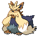
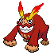

# Route 7 – Trainer Rosters

---

## Generic Trainers</h3>

| Trainer | P1 | P2 | P3 | P4 | P5 | P6 |
|:-------:|:--:|:--:|:--:|:--:|:--:|:--:|
|  Youngster Mikey |  [Tauros](../../pokemon/tauros.md/) Lv. 44 |  [Hitmonlee](../../pokemon/hitmonlee.md/) Lv. 44 |  [Stoutland](../../pokemon/stoutland.md/) Lv. 44 |
|  Youngster Parker |  [Darmanitan](../../pokemon/darmanitan-standard.md/) Lv. 44 |  [Accelgor](../../pokemon/accelgor.md/) Lv. 44 |  [Breloom](../../pokemon/breloom.md/) Lv. 44 |
|  Backpacker Terrance |  [Grumpig](../../pokemon/grumpig.md/) Lv. 45 |  [Huntail](../../pokemon/huntail.md/) Lv. 45 |
|  Ace Trainer Elmer |  [Venusaur](../../pokemon/venusaur.md/) Lv. 45 |  [Charizard](../../pokemon/charizard.md/) Lv. 45 |  [Blastoise](../../pokemon/blastoise.md/) Lv. 45 |
|  Backpacker Ruth |  [Venomoth](../../pokemon/venomoth.md/) Lv. 45 |  [Rapidash](../../pokemon/rapidash.md/) Lv. 45 |
|  PKMN Ranger Mary |  [Stantler](../../pokemon/stantler.md/) Lv. 44 |  [Ambipom](../../pokemon/ambipom.md/) Lv. 44 |  [Altaria](../../pokemon/altaria.md/) Lv. 44 |
|  PKMN Ranger Pedro |  [Deino](../../pokemon/deino.md/) Lv. 45 |  [Heatmor](../../pokemon/heatmor.md/) Lv. 45 |
|  Harlequin Ian |  [Clefable](../../pokemon/clefable.md/) Lv. 44 |  [Dodrio](../../pokemon/dodrio.md/) Lv. 44 |  [Golduck](../../pokemon/golduck.md/) Lv. 44 |
|  Harlequin Pat |  [Victreebel](../../pokemon/victreebel.md/) Lv. 44 |  [Hitmontop](../../pokemon/hitmontop.md/) Lv. 44 |  [Meganium](../../pokemon/meganium.md/) Lv. 44 |

