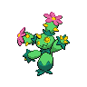

---

## Important Trainers

1. [Rival Bianca – 5](../important_trainers#rival-bianca-5)

---

## Generic Trainers</h3>

| Trainer | P1 | P2 | P3 | P4 | P5 | P6 |
|:-------:|:--:|:--:|:--:|:--:|:--:|:--:|
|  PKMN Ranger Lewis |  [Maractus](../../pokemon/maractus.wild_md/) Lv. 57 |  [Politoed](../../pokemon/politoed.wild_md/) Lv. 57 |  [Escavalier](../../pokemon/escavalier.wild_md/) Lv. 57 |
|  Parasol Lady Melita |  [Jellicent](../../pokemon/jellicent.wild_md/) Lv. 58 |  [Kingdra](../../pokemon/kingdra.wild_md/) Lv. 58 |
|  Fisherman Bruce |  [Basculin](../../pokemon/basculin-red-striped.wild_md/) Lv. 58 |  [Basculin](../../pokemon/basculin-red-striped.wild_md/) Lv. 58 |  [Kingler](../../pokemon/kingler.wild_md/) Lv. 58 |  [Whiscash](../../pokemon/whiscash.wild_md/) Lv. 58 |
|  Parasol Lady Lumi |  [Flareon](../../pokemon/flareon.wild_md/) Lv. 58 |  [Flygon](../../pokemon/flygon.wild_md/) Lv. 58 |
|  PKMN Ranger Annie |  [Tropius](../../pokemon/tropius.wild_md/) Lv. 58 |  [Cinccino](../../pokemon/cinccino.wild_md/) Lv. 58 |  [Archeops](../../pokemon/archeops.wild_md/) Lv. 58 |

