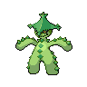
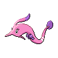
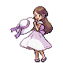

---

## Generic Trainers</h3>

| Trainer | P1 | P2 | P3 | P4 | P5 | P6 |
|:-------:|:--:|:--:|:--:|:--:|:--:|:--:|
|  Roughneck Reese |  [Scrafty](../../pokemon/scrafty.md/) Lv. 61 |  [Garbodor](../../pokemon/garbodor.md/) Lv. 61 |
|  Biker Philip |  [Bouffalant](../../pokemon/bouffalant.md/) Lv. 62 |
|  Hooligans Jim & Cas |  [Cacturne](../../pokemon/cacturne.md/) Lv. 61 |  [Shiftry](../../pokemon/shiftry.md/) Lv. 61 |
|  Biker Zeke |  [Pawniard](../../pokemon/pawniard.md/) Lv. 61 |  [Bisharp](../../pokemon/bisharp.md/) Lv. 61 |
|  Roughneck Chance |  [Chansey](../../pokemon/chansey.md/) Lv. 62 |
|  Waitress Flo |  [Clefable](../../pokemon/clefable.md/) Lv. 61 |  [Lilligant](../../pokemon/lilligant.md/) Lv. 61 |  [Gorebyss](../../pokemon/gorebyss.md/) Lv. 61 |
|  Rich Boy Manuel |  [Arcanine](../../pokemon/arcanine.md/) Lv. 61 |  [Raichu](../../pokemon/raichu.md/) Lv. 61 |  [Grumpig](../../pokemon/grumpig.md/) Lv. 61 |
|  Waiter Bert |  [Simisage](../../pokemon/simisage.md/) Lv. 61 |  [Chandelure](../../pokemon/chandelure.md/) Lv. 61 |  [Politoed](../../pokemon/politoed.md/) Lv. 61 |
|  Lady Isabel |  [Stoutland](../../pokemon/stoutland.md/) Lv. 61 |  [Gengar](../../pokemon/gengar.md/) Lv. 61 |  [Snorlax](../../pokemon/snorlax.md/) Lv. 61 |

