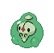

### Grass

| Sprite | Pokémon | Encounter Type | Chance |
| :---: | --- | :---: | --- |
|  | [Gothorita](../../pokemon/gothorita.md/) | {: style='max-width: 24px;' } | 20% |
|  | [Duosion](../../pokemon/duosion.md/) | {: style='max-width: 24px;' } | 20% |
|  | [Kirlia](../../pokemon/kirlia.md/) | {: style='max-width: 24px;' } | 10% |
|  | [Minccino](../../pokemon/minccino.md/) | {: style='max-width: 24px;' } | 10% |
|  | [Pawniard](../../pokemon/pawniard.md/) | {: style='max-width: 24px;' } | 10% |
|  | [Skitty](../../pokemon/skitty.md/) | {: style='max-width: 24px;' } | 10% |
|  | [Liepard](../../pokemon/liepard.md/) | {: style='max-width: 24px;' } | 10% |
|  | [Persian](../../pokemon/persian.md/) | {: style='max-width: 24px;' } | 10%

### Dark Grass

| Sprite | Pokémon | Encounter Type | Chance |
| :---: | --- | :---: | --- |
|  | [Flaaffy](../../pokemon/flaaffy.md/) | {: style='max-width: 24px;' } | 20% |
|  | [Luxio](../../pokemon/luxio.md/) | {: style='max-width: 24px;' } | 20% |
|  | [Hypno](../../pokemon/hypno.md/) | {: style='max-width: 24px;' } | 10% |
|  | [Cinccino](../../pokemon/cinccino.md/) | {: style='max-width: 24px;' } | 10% |
|  | [Bisharp](../../pokemon/bisharp.md/) | {: style='max-width: 24px;' } | 10% |
|  | [Garbodor](../../pokemon/garbodor.md/) | {: style='max-width: 24px;' } | 10% |
|  | [Houndoom](../../pokemon/houndoom.md/) | {: style='max-width: 24px;' } | 10% |
|  | [Granbull](../../pokemon/granbull.md/) | {: style='max-width: 24px;' } | 10%

### Rustling Grass

| Sprite | Pokémon | Encounter Type | Chance |
| :---: | --- | :---: | --- |
|  | [Audino](../../pokemon/audino.md/) | {: style='max-width: 24px;' } | 90% |
|  | [Gothitelle](../../pokemon/gothitelle.md/) | {: style='max-width: 24px;' } | 5% |
|  | [Reuniclus](../../pokemon/reuniclus.md/) | {: style='max-width: 24px;' } | 5% |

### Legendary Encounter

| Sprite | Pokémon | Level | Encounter Type | Location | Chance |
| :---: | --- | --- | :---: | --- | --- |
|  | Raikou | Level 50 | {: style='max-width: 24px;' } | Route 9 | 1% |

### Legendary Encounter

| Sprite | Pokémon | Level | Encounter Type | Location | Chance |
| :---: | --- | --- | :---: | --- | --- |
|  | Entei | Level 50 | {: style='max-width: 24px;' } | Route 9 | 1% |
