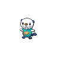

---

## Rival Cheren – 2

**Battle Type:** Single Battle

=== "Tepig"

    | Pokemon | Attributes | Moves |
    |:-------:|------------|-------|
    |  |**Lv. 11** [Starly](../../pokemon/starly.md/) **Item:** No Item **Ability:** Keen Eye | 1. — 2. — 3. — 4. — |
    |  |**Lv. 12** [Oshawott](../../pokemon/oshawott.md/) **Item:** Oran Berry **Ability:** Contrary | 1. — 2. — 3. — 4. — |
    

=== "Snivy"

    | Pokemon | Attributes | Moves |
    |:-------:|------------|-------|
    |  |**Lv. 11** [Starly](../../pokemon/starly.md/) **Item:** No Item **Ability:** Keen Eye | 1. — 2. — 3. — 4. — |
    |  |**Lv. 12** [Tepig](../../pokemon/tepig.md/) **Item:** Oran Berry **Ability:** Vital Spirit | 1. — 2. — 3. — 4. — |
    

=== "Oshawott"

    | Pokemon | Attributes | Moves |
    |:-------:|------------|-------|
    |  |**Lv. 11** [Starly](../../pokemon/starly.md/) **Item:** No Item **Ability:** Keen Eye | 1. — 2. — 3. — 4. — |
    |  |**Lv. 12** [Snivy](../../pokemon/snivy.md/) **Item:** Oran Berry **Ability:** Adaptability | 1. — 2. — 3. — 4. — |
    

---

## Gym Leader Cilan

**Battle Type:** Rotation Battle

**Reward:** TM83 Work Up

| Pokemon | Attributes | Moves |
|:-------:|------------|-------|
|  |**Lv. 12** [Snivy](../../pokemon/snivy.md/) **Item:** No Item **Ability:** Overgrow | 1. Tackle 2. Growth 3. Magical Leaf 4. Twister |
|  |**Lv. 12** [Bulbasaur](../../pokemon/bulbasaur.md/) **Item:** No Item **Ability:** Overgrow | 1. Secret Power 2. Sleep Powder 3. Leech Seed 4. Vine Whip |
|  |**Lv. 12** [Chikorita](../../pokemon/chikorita.md/) **Item:** No Item **Ability:** Overgrow | 1. Wring Out 2. Synthesis 3. Razor Leaf 4. Poison Powder |
|  |**Lv. 12** [Treecko](../../pokemon/treecko.md/) **Item:** No Item **Ability:** Overgrow | 1. Grass Whistle 2. Leech Seed 3. Absorb 4. Quick Attack |
|  |**Lv. 12** [Turtwig](../../pokemon/turtwig.md/) **Item:** No Item **Ability:** Overgrow | 1. Tackle 2. Tickle 3. Razor Leaf 4. Stealth Rock |
|  |**Lv. 14** [Pansage](../../pokemon/pansage.md/) **Item:** Oran Berry **Ability:** Gluttony | 1. Work Up 2. Bite 3. Magical Leaf 4. Protect |

---

## Gym Leader Cress

**Battle Type:** Rotation Battle

**Reward:** TM83 Work Up

| Pokemon | Attributes | Moves |
|:-------:|------------|-------|
|  |**Lv. 12** [Oshawott](../../pokemon/oshawott.md/) **Item:** No Item **Ability:** Torrent | 1. Tackle 2. Screech 3. Brine 4. Air Slash |
|  |**Lv. 12** [Squirtle](../../pokemon/squirtle.md/) **Item:** No Item **Ability:** Torrent | 1. Tackle 2. Iron Defense 3. Aqua Jet 4. Fake Out |
|  |**Lv. 12** [Totodile](../../pokemon/totodile.md/) **Item:** No Item **Ability:** Torrent | 1. Scratch 2. Dragon Dance 3. Aqua Jet 4. Bite |
|  |**Lv. 12** [Mudkip](../../pokemon/mudkip.md/) **Item:** No Item **Ability:** Torrent | 1. Tackle 2. Ice Ball 3. Mud Bomb 4. Water Gun |
|  |**Lv. 12** [Piplup](../../pokemon/piplup.md/) **Item:** No Item **Ability:** Torrent | 1. Pound 2. Icy Wind 3. Bubble Beam 4. Pluck |
|  |**Lv. 14** [Panpour](../../pokemon/panpour.md/) **Item:** Oran Berry **Ability:** Gluttony | 1. Nasty Plot 2. Bite 3. Water Gun 4. Protect |

---

## Gym Leader Chili

**Battle Type:** Rotation Battle

**Reward:** TM83 Work Up

| Pokemon | Attributes | Moves |
|:-------:|------------|-------|
|  |**Lv. 12** [Tepig](../../pokemon/tepig.md/) **Item:** No Item **Ability:** Blaze | 1. Tackle 2. Yawn 3. Ember 4. Magnitude |
|  |**Lv. 12** [Charmander](../../pokemon/charmander.md/) **Item:** No Item **Ability:** Blaze | 1. Scratch 2. Dragon Dance 3. Ember 4. Smokescreen |
|  |**Lv. 12** [Cyndaquil](../../pokemon/cyndaquil.md/) **Item:** No Item **Ability:** Blaze | 1. Quick Attack 2. Nature Power 3. Smokescreen 4. Flame Burst |
|  |**Lv. 12** [Torchic](../../pokemon/torchic.md/) **Item:** No Item **Ability:** Blaze | 1. Low Kick 2. Focus Energy 3. Ember 4. Featherdance |
|  |**Lv. 12** [Chimchar](../../pokemon/chimchar.md/) **Item:** No Item **Ability:** Blaze | 1. Assist 2. Fake Out 3. Ember 4. Torment |
|  |**Lv. 14** [Pansear](../../pokemon/pansear.md/) **Item:** Oran Berry **Ability:** Gluttony | 1. Nasty Plot 2. Bite 3. Incinerate 4. Protect |

