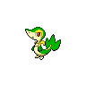
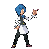
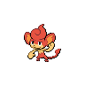

# Striaton City – Important Trainers

---

## Rival Cheren – 2

**Battle Type:** Single Battle

=== "Tepig"

    | Pokémon | Attributes | Item | Moves |
    |:-------:|------------|:----:|-------|
    |  | **Lv. 11** [Starly](../../pokemon/starly.md/) **Ability:** Keen Eye {: width="48"} {: width="48"} | No Item | 1. — 2. — 3. — 4. — |
    |  | **Lv. 12** [Oshawott](../../pokemon/oshawott.md/) **Ability:** Contrary {: width="48"} |  Oran Berry | 1. — 2. — 3. — 4. — |
    

=== "Snivy"

    | Pokémon | Attributes | Item | Moves |
    |:-------:|------------|:----:|-------|
    |  | **Lv. 11** [Starly](../../pokemon/starly.md/) **Ability:** Keen Eye {: width="48"} {: width="48"} | No Item | 1. — 2. — 3. — 4. — |
    |  | **Lv. 12** [Tepig](../../pokemon/tepig.md/) **Ability:** Vital Spirit {: width="48"} |  Oran Berry | 1. — 2. — 3. — 4. — |
    

=== "Oshawott"

    | Pokémon | Attributes | Item | Moves |
    |:-------:|------------|:----:|-------|
    |  | **Lv. 11** [Starly](../../pokemon/starly.md/) **Ability:** Keen Eye {: width="48"} {: width="48"} | No Item | 1. — 2. — 3. — 4. — |
    |  | **Lv. 12** [Snivy](../../pokemon/snivy.md/) **Ability:** Adaptability {: width="48"} |  Oran Berry | 1. — 2. — 3. — 4. — |
    

---

## Gym Leader Cilan

**Battle Type:** Rotation Battle

**Reward:** TM83 Work Up

    | Pokémon | Attributes | Item | Moves |
    |:-------:|------------|:----:|-------|
|  | **Lv. 12** [Snivy](../../pokemon/snivy.md/) **Ability:** ? {: width="48"} | No Item | 1: Tackle 2: Growth 3: Magical Leaf 4: Twister |
|  | **Lv. 12** [Bulbasaur](../../pokemon/bulbasaur.md/) **Ability:** ? {: width="48"} {: width="48"} | No Item | 1: Secret Power 2: Sleep Powder 3: Leech Seed 4: Vine Whip |
|  | **Lv. 12** [Chikorita](../../pokemon/chikorita.md/) **Ability:** ? {: width="48"} | No Item | 1: Wring Out 2: Synthesis 3: Razor Leaf 4: Poison Powder |
|  | **Lv. 12** [Treecko](../../pokemon/treecko.md/) **Ability:** ? {: width="48"} | No Item | 1: Grass Whistle 2: Leech Seed 3: Absorb 4: Quick Attack |
|  | **Lv. 12** [Turtwig](../../pokemon/turtwig.md/) **Ability:** ? {: width="48"} | No Item | 1: Tackle 2: Tickle 3: Razor Leaf 4: Stealth Rock |
|  | **Lv. 14** [Pansage](../../pokemon/pansage.md/) **Ability:** ? {: width="48"} |  Oran Berry | 1: Work Up 2: Bite 3: Magical Leaf 4: Protect |

---

## Gym Leader Cress

**Battle Type:** Rotation Battle

**Reward:** TM83 Work Up

    | Pokémon | Attributes | Item | Moves |
    |:-------:|------------|:----:|-------|
|  | **Lv. 12** [Oshawott](../../pokemon/oshawott.md/) **Ability:** ? {: width="48"} | No Item | 1: Tackle 2: Screech 3: Brine 4: Air Slash |
|  | **Lv. 12** [Squirtle](../../pokemon/squirtle.md/) **Ability:** ? {: width="48"} | No Item | 1: Tackle 2: Iron Defense 3: Aqua Jet 4: Fake Out |
|  | **Lv. 12** [Totodile](../../pokemon/totodile.md/) **Ability:** ? {: width="48"} | No Item | 1: Scratch 2: Dragon Dance 3: Aqua Jet 4: Bite |
|  | **Lv. 12** [Mudkip](../../pokemon/mudkip.md/) **Ability:** ? {: width="48"} | No Item | 1: Tackle 2: Ice Ball 3: Mud Bomb 4: Water Gun |
|  | **Lv. 12** [Piplup](../../pokemon/piplup.md/) **Ability:** ? {: width="48"} | No Item | 1: Pound 2: Icy Wind 3: Bubble Beam 4: Pluck |
|  | **Lv. 14** [Panpour](../../pokemon/panpour.md/) **Ability:** ? {: width="48"} |  Oran Berry | 1: Nasty Plot 2: Bite 3: Water Gun 4: Protect |

---

## Gym Leader Chili

**Battle Type:** Rotation Battle

**Reward:** TM83 Work Up

    | Pokémon | Attributes | Item | Moves |
    |:-------:|------------|:----:|-------|
|  | **Lv. 12** [Tepig](../../pokemon/tepig.md/) **Ability:** ? {: width="48"} | No Item | 1: Tackle 2: Yawn 3: Ember 4: Magnitude |
|  | **Lv. 12** [Charmander](../../pokemon/charmander.md/) **Ability:** ? {: width="48"} | No Item | 1: Scratch 2: Dragon Dance 3: Ember 4: Smokescreen |
|  | **Lv. 12** [Cyndaquil](../../pokemon/cyndaquil.md/) **Ability:** ? {: width="48"} | No Item | 1: Quick Attack 2: Nature Power 3: Smokescreen 4: Flame Burst |
|  | **Lv. 12** [Torchic](../../pokemon/torchic.md/) **Ability:** ? {: width="48"} | No Item | 1: Low Kick 2: Focus Energy 3: Ember 4: Feather Dance |
|  | **Lv. 12** [Chimchar](../../pokemon/chimchar.md/) **Ability:** ? {: width="48"} | No Item | 1: Assist 2: Fake Out 3: Ember 4: Torment |
|  | **Lv. 14** [Pansear](../../pokemon/pansear.md/) **Ability:** ? {: width="48"} |  Oran Berry | 1: Nasty Plot 2: Bite 3: Incinerate 4: Protect |

