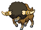

# Tubeline Bridge – Trainer Rosters

---

## Generic Trainers</h3>

| Trainer | P1 | P2 | P3 | P4 | P5 | P6 |
|:-------:|:--:|:--:|:--:|:--:|:--:|:--:|
|  Biker Morgann |  [Tauros](../../pokemon/tauros.md/) Lv. 60 |
|  Biker Jeremy |  [Bouffalant](../../pokemon/bouffalant.md/) Lv. 60 |

