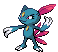
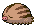
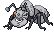

### Cave, Normal

| Sprite | Pokémon | Encounter Type | Chance |
| :---: | --- | :---: | --- |
|  | [Phanpy](../pokemon/phanpy.md/) | {: style='max-width: 24px;' } | 20% |
|  | [Teddiursa](../pokemon/teddiursa.md/) | {: style='max-width: 24px;' } | 20% |
|  | [Cubchoo](../pokemon/cubchoo.md/) | {: style='max-width: 24px;' } | 10% |
|  | [Sneasel](../pokemon/sneasel.md/) | {: style='max-width: 24px;' } | 10% |
|  | [Delibird](../pokemon/delibird.md/) | {: style='max-width: 24px;' } | 10% |
|  | [Swinub](../pokemon/swinub.md/) | {: style='max-width: 24px;' } | 10% |
|  | [Graveler](../pokemon/graveler.md/) | {: style='max-width: 24px;' } | 5% |
|  | [Boldore](../pokemon/boldore.md/) | {: style='max-width: 24px;' } | 5% |
|  | [Cryogonal](../pokemon/cryogonal.md/) | {: style='max-width: 24px;' } | 5% |
|  | [Gurdurr](../pokemon/gurdurr.md/) | {: style='max-width: 24px;' } | 5%

### Cave, Special

| Sprite | Pokémon | Encounter Type | Chance |
| :---: | --- | :---: | --- |
|  | [Excadrill](../pokemon/excadrill.md/) | {: style='max-width: 24px;' } | 50% |
|  | [Dugtrio](../pokemon/dugtrio.md/) | {: style='max-width: 24px;' } | 50%

### Cave, Normal

| Sprite | Pokémon | Encounter Type | Chance |
| :---: | --- | :---: | --- |
|  | [Donphan](../pokemon/donphan.md/) | {: style='max-width: 24px;' } | 20% |
|  | [Ursaring](../pokemon/ursaring.md/) | {: style='max-width: 24px;' } | 20% |
|  | [Beartic](../pokemon/beartic.md/) | {: style='max-width: 24px;' } | 10% |
|  | [Sneasel](../pokemon/sneasel.md/) | {: style='max-width: 24px;' } | 10% |
|  | [Delibird](../pokemon/delibird.md/) | {: style='max-width: 24px;' } | 10% |
|  | [Piloswine](../pokemon/piloswine.md/) | {: style='max-width: 24px;' } | 10% |
|  | [Mawile](../pokemon/mawile.md/) | {: style='max-width: 24px;' } | 5% |
|  | [Sableye](../pokemon/sableye.md/) | {: style='max-width: 24px;' } | 5% |
|  | [Cryogonal](../pokemon/cryogonal.md/) | {: style='max-width: 24px;' } | 5% |
|  | [Durant](../pokemon/durant.md/) | {: style='max-width: 24px;' } | 5%

### Cave, Special

| Sprite | Pokémon | Encounter Type | Chance |
| :---: | --- | :---: | --- |
|  | [Excadrill](../pokemon/excadrill.md/) | {: style='max-width: 24px;' } | 50% |
|  | [Dugtrio](../pokemon/dugtrio.md/) | {: style='max-width: 24px;' } | 50% |

### Legendary Encounter

| Sprite | Pokémon | Level | Encounter Type | Location | Chance |
| :---: | --- | --- | :---: | --- | --- |
|  | Regice | Level 50 | {: style='max-width: 24px;' } | Twist Mountain, Ice Rock Room, Winter | 1% |
