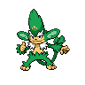

---

## Rival Cheren – 6

**Battle Type:** Rotation Battle

=== "Tepig"

    | Pokemon | Attributes | Moves |
    |:-------:|------------|-------|
    |  |**Lv. 53** [Staraptor](../../pokemon/staraptor.md/) **Item:** Sharp Beak **Ability:** Reckless | 1: Brave Bird 2: Close Combat 3: Retaliate 4: U-turn |
    |  |**Lv. 53** [Gigalith](../../pokemon/gigalith.md/) **Item:** Hard Stone **Ability:** Sturdy | 1: Stone Edge 2: Stealth Rock 3: Earthquake 4: Explosion |
    |  |**Lv. 53** [Alakazam](../../pokemon/alakazam.md/) **Item:** Twisted Spoon **Ability:** Magic Guard | 1: Psychic 2: Shadow Ball 3: Energy Ball 4: Charge Beam |
    |  |**Lv. 53** [Whimsicott](../../pokemon/whimsicott.md/) **Item:** Lum Berry **Ability:** Intimidate | 1: Flamethrower 2: Dark Pulse 3: Nasty Plot 4: Will-O-Wisp |
    |  |**Lv. 53** [Simisear](../../pokemon/simisear.md/) **Item:** Iron Ball **Ability:** Torrent | 1: Scald 2: Acrobatics 3: Fling 4: Hydro Cannon |
    |  |**Lv. 55** [Samurott](../../pokemon/samurott.md/) **Item:** Sitrus Berry **Ability:** Contrary | 1: Leaf Blade 2: Leech Seed 3: Glare 4: Dragon Pulse |
    

=== "Snivy"

    | Pokemon | Attributes | Moves |
    |:-------:|------------|-------|
    |  |**Lv. 53** [Staraptor](../../pokemon/staraptor.md/) **Item:** Sharp Beak **Ability:** Reckless | 1: Brave Bird 2: Close Combat 3: Retaliate 4: U-turn |
    |  |**Lv. 53** [Gigalith](../../pokemon/gigalith.md/) **Item:** Hard Stone **Ability:** Sturdy | 1: Stone Edge 2: Stealth Rock 3: Earthquake 4: Explosion |
    |  |**Lv. 53** [Alakazam](../../pokemon/alakazam.md/) **Item:** Twisted Spoon **Ability:** Magic Guard | 1: Psychic 2: Shadow Ball 3: Energy Ball 4: Charge Beam |
    |  |**Lv. 53** [Gyarados](../../pokemon/gyarados.md/) **Item:** Lum Berry **Ability:** Prankster | 1: Energy Ball 2: Hurricane 3: Tailwind 4: Cotton Guard |
    |  |**Lv. 53** [Simisage](../../pokemon/simisage.md/) **Item:** Iron Ball **Ability:** Blaze | 1: Flame Burst 2: Acrobatics 3: Fling 4: Blast Burn |
    |  |**Lv. 55** [Emboar](../../pokemon/emboar.md/) **Item:** Sitrus Berry **Ability:** ?1: Scald 2: Swords Dance 3: Megahorn 4: Sacred Sword |
    

=== "Oshawott"

    | Pokemon | Attributes | Moves |
    |:-------:|------------|-------|
    |  |**Lv. 53** [Staraptor](../../pokemon/staraptor.md/) **Item:** Sharp Beak **Ability:** Reckless | 1: Brave Bird 2: Close Combat 3: Retaliate 4: U-turn |
    |  |**Lv. 53** [Gigalith](../../pokemon/gigalith.md/) **Item:** Hard Stone **Ability:** Sturdy | 1: Stone Edge 2: Stealth Rock 3: Earthquake 4: Explosion |
    |  |**Lv. 53** [Alakazam](../../pokemon/alakazam.md/) **Item:** Twisted Spoon **Ability:** Magic Guard | 1: Psychic 2: Shadow Ball 3: Energy Ball 4: Charge Beam |
    |  |**Lv. 53** [Houndoom](../../pokemon/houndoom.md/) **Item:** Lum Berry **Ability:** Moxie | 1: Aqua Tail 2: Ice Fang 3: Dragon Dance 4: Earthquake |
    |  |**Lv. 53** [Simipour](../../pokemon/simipour.md/) **Item:** Iron Ball **Ability:** Overgrow | 1: Seed Bomb 2: Acrobatics 3: Fling 4: Frenzy Plant |
    |  |**Lv. 55** [Serperior](../../pokemon/serperior.md/) **Item:** Sitrus Berry **Ability:** ?1: Heat Crash 2: Bulk Up 3: Wild Charge 4: Earthquake |
    

