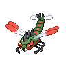

---

## Important Trainers

1. [Rival Cheren – 6](../important_trainers#rival-cheren-6)

---

## Generic Trainers</h3>

| Trainer | P1 | P2 | P3 | P4 | P5 | P6 |
|:-------:|:--:|:--:|:--:|:--:|:--:|:--:|
|  Hiker Terrell |  [Magcargo](../../pokemon/magcargo.wild_md/) Lv. 45 |  [Swampert](../../pokemon/swampert.wild_md/) Lv. 45 |
|  Black Belt Teppei |  [Machamp](../../pokemon/machamp.wild_md/) Lv. 54 |
|  Worker Rich |  [Glalie](../../pokemon/glalie.wild_md/) Lv. 53 |  [Kangaskhan](../../pokemon/kangaskhan.wild_md/) Lv. 53 |
|  Worker Rob |  [Metang](../../pokemon/metang.wild_md/) Lv. 54 |  [Toxicroak](../../pokemon/toxicroak.wild_md/) Lv. 54 |  [Medicham](../../pokemon/medicham.wild_md/) Lv. 54 |
|  Worker Cairn |  [Excadrill](../../pokemon/excadrill.wild_md/) Lv. 53 |  [Hariyama](../../pokemon/hariyama.wild_md/) Lv. 53 |  [Dugtrio](../../pokemon/dugtrio.wild_md/) Lv. 53 |
|  Doctor Hank |  [Jynx](../../pokemon/jynx.wild_md/) Lv. 53 |  [Mr. Mime](../../pokemon/mr-mime.wild_md/) Lv. 53 |  [Wobbuffet](../../pokemon/wobbuffet.wild_md/) Lv. 53 |
|  Hiker Neil |  [Boldore](../../pokemon/boldore.wild_md/) Lv. 52 |  [Probopass](../../pokemon/probopass.wild_md/) Lv. 52 |  [Gigalith](../../pokemon/gigalith.wild_md/) Lv. 52 |
|  Hiker Darrell |  [Sudowoodo](../../pokemon/sudowoodo.wild_md/) Lv. 52 |  [Golbat](../../pokemon/golbat.wild_md/) Lv. 52 |  [Crustle](../../pokemon/crustle.wild_md/) Lv. 52 |
|  Battle Girl Sharon |  [Mienshao](../../pokemon/mienshao.wild_md/) Lv. 54 |  [Breloom](../../pokemon/breloom.wild_md/) Lv. 54 |
|  Ace Trainer Caroll |  [Gorebyss](../../pokemon/gorebyss.wild_md/) Lv. 55 |  [Typhlosion](../../pokemon/typhlosion.wild_md/) Lv. 55 |  [Scizor](../../pokemon/scizor.wild_md/) Lv. 55 |
|  Worker Brand |  [Sandslash](../../pokemon/sandslash.wild_md/) Lv. 53 |  [Swoobat](../../pokemon/swoobat.wild_md/) Lv. 53 |
|  Worker Heath |  [Machoke](../../pokemon/machoke.wild_md/) Lv. 53 |  [Darmanitan](../../pokemon/darmanitan-standard.wild_md/) Lv. 53 |
|  Ace Trainer Jordan |  [Zebstrika](../../pokemon/zebstrika.wild_md/) Lv. 55 |  [Simisage](../../pokemon/simisage.wild_md/) Lv. 55 |  [Yanmega](../../pokemon/yanmega.wild_md/) Lv. 55 |

