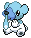
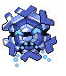
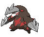
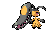

### Cave

| Sprite | Pokémon | Encounter Type | Chance |
| :---: | --- | :---: | --- |
|  | [Phanpy](../../pokemon/phanpy.md/) | {: style='max-width: 24px;' } | 20% |
|  | [Teddiursa](../../pokemon/teddiursa.md/) | {: style='max-width: 24px;' } | 20% |
|  | [Cubchoo](../../pokemon/cubchoo.md/) | {: style='max-width: 24px;' } | 10% |
|  | [Sneasel](../../pokemon/sneasel.md/) | {: style='max-width: 24px;' } | 10% |
|  | [Delibird](../../pokemon/delibird.md/) | {: style='max-width: 24px;' } | 10% |
|  | [Swinub](../../pokemon/swinub.md/) | {: style='max-width: 24px;' } | 10% |
|  | [Graveler](../../pokemon/graveler.md/) | {: style='max-width: 24px;' } | 5% |
|  | [Boldore](../../pokemon/boldore.md/) | {: style='max-width: 24px;' } | 5% |
|  | [Cryogonal](../../pokemon/cryogonal.md/) | {: style='max-width: 24px;' } | 5% |
|  | [Gurdurr](../../pokemon/gurdurr.md/) | {: style='max-width: 24px;' } | 5%

### Dust Cloud

| Sprite | Pokémon | Encounter Type | Chance |
| :---: | --- | :---: | --- |
|  | [Excadrill](../../pokemon/excadrill.md/) | {: style='max-width: 24px;' } | 50% |
|  | [Dugtrio](../../pokemon/dugtrio.md/) | {: style='max-width: 24px;' } | 50%

### Cave

| Sprite | Pokémon | Encounter Type | Chance |
| :---: | --- | :---: | --- |
|  | [Donphan](../../pokemon/donphan.md/) | {: style='max-width: 24px;' } | 20% |
|  | [Ursaring](../../pokemon/ursaring.md/) | {: style='max-width: 24px;' } | 20% |
|  | [Beartic](../../pokemon/beartic.md/) | {: style='max-width: 24px;' } | 10% |
|  | [Sneasel](../../pokemon/sneasel.md/) | {: style='max-width: 24px;' } | 10% |
|  | [Delibird](../../pokemon/delibird.md/) | {: style='max-width: 24px;' } | 10% |
|  | [Piloswine](../../pokemon/piloswine.md/) | {: style='max-width: 24px;' } | 10% |
|  | [Mawile](../../pokemon/mawile.md/) | {: style='max-width: 24px;' } | 5% |
|  | [Sableye](../../pokemon/sableye.md/) | {: style='max-width: 24px;' } | 5% |
|  | [Cryogonal](../../pokemon/cryogonal.md/) | {: style='max-width: 24px;' } | 5% |
|  | [Durant](../../pokemon/durant.md/) | {: style='max-width: 24px;' } | 5%

### Dust Cloud

| Sprite | Pokémon | Encounter Type | Chance |
| :---: | --- | :---: | --- |
|  | [Excadrill](../../pokemon/excadrill.md/) | {: style='max-width: 24px;' } | 50% |
|  | [Dugtrio](../../pokemon/dugtrio.md/) | {: style='max-width: 24px;' } | 50% |

### Legendary Encounter

| Sprite | Pokémon | Level | Encounter Type | Location | Chance |
| :---: | --- | --- | :---: | --- | --- |
|  | Regice | Level 50 | {: style='max-width: 24px;' } | Twist Mountain, Ice Rock Room, Winter | 1% |
