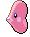

### Surf, Normal

| Sprite | Pokémon | Encounter Type | Chance |
| :---: | --- | :---: | --- |
|  | [Luvdisc](../pokemon/luvdisc.md/) | {: style='max-width: 24px;' } | 60% |
|  | [Corsola](../pokemon/corsola.md/) | {: style='max-width: 24px;' } | 40%

### Surf, Special

| Sprite | Pokémon | Encounter Type | Chance |
| :---: | --- | :---: | --- |
|  | [Alomomola](../pokemon/alomomola.md/) | {: style='max-width: 24px;' } | 100%

### Fish, Normal

| Sprite | Pokémon | Encounter Type | Chance |
| :---: | --- | :---: | --- |
|  | [Remoraid](../pokemon/remoraid.md/) | {: style='max-width: 24px;' } | 65% |
|  | [Shellder](../pokemon/shellder.md/) | {: style='max-width: 24px;' } | 30% |
|  | [Luvdisc](../pokemon/luvdisc.md/) | {: style='max-width: 24px;' } | 5%

### Fish, Special

| Sprite | Pokémon | Encounter Type | Chance |
| :---: | --- | :---: | --- |
|  | [Shellder](../pokemon/shellder.md/) | {: style='max-width: 24px;' } | 60% |
|  | [Luvdisc](../pokemon/luvdisc.md/) | {: style='max-width: 24px;' } | 30% |
|  | [Octillery](../pokemon/octillery.md/) | {: style='max-width: 24px;' } | 5% |
|  | [Cloyster](../pokemon/cloyster.md/) | {: style='max-width: 24px;' } | 5% |
