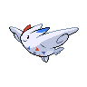

---

## PKMN Trainer Cynthia

**Battle Type:** Single Battle

| Pokemon | Attributes | Moves |
|:-------:|------------|-------|
|  |**Lv. 95** [Spiritomb](../../pokemon/spiritomb.md/) **Item:** Lax Incense **Ability:** Pressure | 1: Nasty Plot 2: Dark Pulse 3: Will-O-Wisp 4: Pain Split |
|  |**Lv. 95** [Roserade](../../pokemon/roserade.md/) **Item:** Rose Incense **Ability:** Technician | 1: Sleep Powder 2: Sludge Bomb 3: Magical Leaf 4: Quiver Dance |
|  |**Lv. 95** [Milotic](../../pokemon/milotic.md/) **Item:** Sea Incense **Ability:** Multiscale | 1: Hydro Pump 2: Blizzard 3: Recover 4: Toxic |
|  |**Lv. 95** [Togekiss](../../pokemon/togekiss.md/) **Item:** Scope Lens **Ability:** Serene Grace | 1: Thunder Wave 2: Air Slash 3: Tri Attack 4: Aura Sphere |
|  |**Lv. 95** [Lucario](../../pokemon/lucario.md/) **Item:** Life Orb **Ability:** Justified | 1: Nasty Plot 2: Aura Sphere 3: Dragon Pulse 4: Ice Punch |
|  |**Lv. 100** [Garchomp](../../pokemon/garchomp.md/) **Item:** Life Orb **Ability:** Rough Skin | 1: Outrage 2: Earthquake 3: Stone Edge 4: Extreme Speed |

