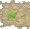

---

## Victory Road – Outsid

### Rocky Grass

| Sprite | Pokémon | Encounter Type | Chance |
| :---: | --- | :---: | --- |
|  | [Heatmor](../pokemon/heatmor.md/) | {: style='max-width: 24px;' } | 20% |
|  | [Torkoal](../pokemon/torkoal.md/) | {: style='max-width: 24px;' } | 20% |
|  | [Mandibuzz](../pokemon/mandibuzz.md/) | {: style='max-width: 24px;' } | 10% |
|  | [Braviary](../pokemon/braviary.md/) | {: style='max-width: 24px;' } | 10% |
|  | [Skarmory](../pokemon/skarmory.md/) | {: style='max-width: 24px;' } | 10% |
|  | [Gliscor](../pokemon/gliscor.md/) | {: style='max-width: 24px;' } | 10% |
|  | [Pupitar](../pokemon/pupitar.md/) | {: style='max-width: 24px;' } | 10% |
|  | [Fraxure](../pokemon/fraxure.md/) | {: style='max-width: 24px;' } | 9%

---

## Victory Road – Water Rooms

### Cave, Normal

| Sprite | Pokémon | Encounter Type | Chance |
| :---: | --- | :---: | --- |
|  | [Donphan](../pokemon/donphan.md/) | {: style='max-width: 24px;' } | 20% |
|  | [Ursaring](../pokemon/ursaring.md/) | {: style='max-width: 24px;' } | 20% |
|  | [Zweilous](../pokemon/zweilous.md/) | {: style='max-width: 24px;' } | 10% |
|  | [Woobat](../pokemon/woobat.md/) | {: style='max-width: 24px;' } | 10% |
|  | [Hariyama](../pokemon/hariyama.md/) | {: style='max-width: 24px;' } | 10% |
|  | [Medicham](../pokemon/medicham.md/) | {: style='max-width: 24px;' } | 10% |
|  | [Lairon](../pokemon/lairon.md/) | {: style='max-width: 24px;' } | 10% |
|  | [Azumarill](../pokemon/azumarill.md/) | {: style='max-width: 24px;' } | 10%

### Cave, Special

| Sprite | Pokémon | Encounter Type | Chance |
| :---: | --- | :---: | --- |
|  | [Excadrill](../pokemon/excadrill.md/) | {: style='max-width: 24px;' } | 25% |
|  | [Dugtrio](../pokemon/dugtrio.md/) | {: style='max-width: 24px;' } | 25% |
|  | [Steelix](../pokemon/steelix.md/) | {: style='max-width: 24px;' } | 25% |
|  | [Sandslash](../pokemon/sandslash.md/) | {: style='max-width: 24px;' } | 25%

### Surf, Normal

| Sprite | Pokémon | Encounter Type | Chance |
| :---: | --- | :---: | --- |
|  | [Dewgong](../pokemon/dewgong.md/) | {: style='max-width: 24px;' } | 60% |
|  | [Lapras](../pokemon/lapras.md/) | {: style='max-width: 24px;' } | 40%

### Surf, Special

| Sprite | Pokémon | Encounter Type | Chance |
| :---: | --- | :---: | --- |
|  | [Lapras](../pokemon/lapras.md/) | {: style='max-width: 24px;' } | 60% |
|  | [Dewgong](../pokemon/dewgong.md/) | {: style='max-width: 24px;' } | 40%

### Fish, Normal

| Sprite | Pokémon | Encounter Type | Chance |
| :---: | --- | :---: | --- |
|  | [Basculin](../pokemon/basculin.md/) | {: style='max-width: 24px;' } | 60% |
|  | [Gyarados](../pokemon/gyarados.md/) | {: style='max-width: 24px;' } | 30% |
|  | [Whiscash](../pokemon/whiscash.md/) | {: style='max-width: 24px;' } | 10%

### Fish, Special

| Sprite | Pokémon | Encounter Type | Chance |
| :---: | --- | :---: | --- |
|  | [Basculin](../pokemon/basculin.md/) | {: style='max-width: 24px;' } | 60% |
|  | [Gyarados](../pokemon/gyarados.md/) | {: style='max-width: 24px;' } | 30% |
|  | [Whiscash](../pokemon/whiscash.md/) | {: style='max-width: 24px;' } | 10%

---

## Victory Road – No Water Rooms

### Cave, Normal

| Sprite | Pokémon | Encounter Type | Chance |
| :---: | --- | :---: | --- |
|  | [Loudred](../pokemon/loudred.md/) | {: style='max-width: 24px;' } | 20% |
|  | [Durant](../pokemon/durant.md/) | {: style='max-width: 24px;' } | 20% |
|  | [Woobat](../pokemon/woobat.md/) | {: style='max-width: 24px;' } | 10% |
|  | [Golbat](../pokemon/golbat.md/) | {: style='max-width: 24px;' } | 10% |
|  | [Klang](../pokemon/klang.md/) | {: style='max-width: 24px;' } | 10% |
|  | [Rhydon](../pokemon/rhydon.md/) | {: style='max-width: 24px;' } | 10% |
|  | [Boldore](../pokemon/boldore.md/) | {: style='max-width: 24px;' } | 10% |
|  | [Gurdurr](../pokemon/gurdurr.md/) | {: style='max-width: 24px;' } | 10%

### Cave, Special

| Sprite | Pokémon | Encounter Type | Chance |
| :---: | --- | :---: | --- |
|  | [Excadrill](../pokemon/excadrill.md/) | {: style='max-width: 24px;' } | 25% |
|  | [Dugtrio](../pokemon/dugtrio.md/) | {: style='max-width: 24px;' } | 25% |
|  | [Steelix](../pokemon/steelix.md/) | {: style='max-width: 24px;' } | 25% |
|  | [Sandslash](../pokemon/sandslash.md/) | {: style='max-width: 24px;' } | 25% |
