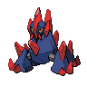

---

## Rival Cheren – Final

=== "Tepig"

    | Pokemon | Attributes | Moves |
    |:-------:|------------|-------|
    |  |**Lv. 88** [Staraptor](../../pokemon/staraptor.md/) **Item:** Life Orb **Ability:** Reckless | 1. Brave Bird 2. Close Combat 3. Double-Edge 4. U-turn |
    |  |**Lv. 88** [Gigalith](../../pokemon/gigalith.md/) **Item:** Custap Berry **Ability:** Sturdy | 1. Stone Edge 2. Stealth Rock 3. Earthquake 4. Explosion |
    |  |**Lv. 88** [Alakazam](../../pokemon/alakazam.md/) **Item:** Life Orb **Ability:** Magic Guard | 1. Psychic 2. Shadow Ball 3. Energy Ball 4. Focus Blast |
    |  |**Lv. 88** [Whimsicott](../../pokemon/whimsicott.md/) **Item:** Leftovers **Ability:** Intimidate | 1. Flamethrower 2. Dark Pulse 3. Nasty Plot 4. Will-O-Wisp |
    |  |**Lv. 88** [Simisear](../../pokemon/simisear.md/) **Item:** Flying Gem **Ability:** Torrent | 1. Work Up 2. Acrobatics 3. Focus Blast 4. Water Spout |
    |  |**Lv. 90** [Samurott](../../pokemon/samurott.md/) **Item:** Life Orb **Ability:** Contrary | 1. Leaf Storm 2. Leech Seed 3. Glare 4. Draco Meteor |
    

=== "Snivy"

    | Pokemon | Attributes | Moves |
    |:-------:|------------|-------|
    |  |**Lv. 88** [Staraptor](../../pokemon/staraptor.md/) **Item:** Life Orb **Ability:** Reckless | 1. Brave Bird 2. Close Combat 3. Double-Edge 4. U-turn |
    |  |**Lv. 88** [Gigalith](../../pokemon/gigalith.md/) **Item:** Custap Berry **Ability:** Sturdy | 1. Stone Edge 2. Stealth Rock 3. Earthquake 4. Explosion |
    |  |**Lv. 88** [Alakazam](../../pokemon/alakazam.md/) **Item:** Life Orb **Ability:** Magic Guard | 1. Psychic 2. Shadow Ball 3. Energy Ball 4. Focus Blast |
    |  |**Lv. 88** [Gyarados](../../pokemon/gyarados.md/) **Item:** Leftovers **Ability:** Prankster | 1. Leech Seed 2. Hurricane 3. Substitute 4. Cotton Guard |
    |  |**Lv. 88** [Simisage](../../pokemon/simisage.md/) **Item:** Flying Gem **Ability:** Blaze | 1. Work Up 2. Acrobatics 3. Focus Blast 4. Fire Blast |
    |  |**Lv. 90** [Emboar](../../pokemon/emboar.md/) **Item:** Life Orb **Ability:** Vital Spirit | 1. Hydro Pump 2. Shell Smash 3. Megahorn 4. Secret Sword |
    

=== "Oshawott"

    | Pokemon | Attributes | Moves |
    |:-------:|------------|-------|
    |  |**Lv. 88** [Staraptor](../../pokemon/staraptor.md/) **Item:** Life Orb **Ability:** Reckless | 1. Brave Bird 2. Close Combat 3. Double-Edge 4. U-turn |
    |  |**Lv. 88** [Gigalith](../../pokemon/gigalith.md/) **Item:** Custap Berry **Ability:** Sturdy | 1. Stone Edge 2. Stealth Rock 3. Earthquake 4. Explosion |
    |  |**Lv. 88** [Alakazam](../../pokemon/alakazam.md/) **Item:** Life Orb **Ability:** Magic Guard | 1. Psychic 2. Shadow Ball 3. Energy Ball 4. Focus Blast |
    |  |**Lv. 88** [Houndoom](../../pokemon/houndoom.md/) **Item:** Leftovers **Ability:** Moxie | 1. Aqua Tail 2. Bounce 3. Dragon Dance 4. Earthquake |
    |  |**Lv. 88** [Simipour](../../pokemon/simipour.md/) **Item:** Flying Gem **Ability:** Overgrow | 1. Work Up 2. Acrobatics 3. Focus Blast 4. Power Whip |
    |  |**Lv. 90** [Serperior](../../pokemon/serperior.md/) **Item:** Life Orb **Ability:** Adaptability | 1. Flare Blitz 2. Bulk Up 3. Wild Charge 4. Earthquake |
    

