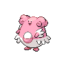

---

## Important Trainers

1. [Rival Cheren – Final](important_trainers.md#rival-cheren-final)

---

## Generic Trainers</h3>

| Trainer | P1 | P2 | P3 | P4 | P5 | P6 |
|:-------:|:--:|:--:|:--:|:--:|:--:|:--:|
|  Ace Trainer Shanta |  [Slowking](../../pokemon/slowking.md/) Lv. 66 |  [Kingdra](../../pokemon/kingdra.md/) Lv. 66 |  [Ludicolo](../../pokemon/ludicolo.md/) Lv. 66 |  [Forretress](../../pokemon/forretress.md/) Lv. 66 |  [Eelektross](../../pokemon/eelektross.md/) Lv. 66 |
|  Ace Trainer Dwayne |  [Volcarona](../../pokemon/volcarona.md/) Lv. 66 |  [Jumpluff](../../pokemon/jumpluff.md/) Lv. 66 |  [Gliscor](../../pokemon/gliscor.md/) Lv. 66 |  [Solrock](../../pokemon/solrock.md/) Lv. 66 |  [Sunflora](../../pokemon/sunflora.md/) Lv. 66 |
|  Veteran Tiffany |  [Arcanine](../../pokemon/arcanine.md/) Lv. 67 |  [Archeops](../../pokemon/archeops.md/) Lv. 67 |  [Alakazam](../../pokemon/alakazam.md/) Lv. 67 |  [Flygon](../../pokemon/flygon.md/) Lv. 67 |  [Cradily](../../pokemon/cradily.md/) Lv. 67 |
|  Black Belt Tyrone |  [Poliwrath](../../pokemon/poliwrath.md/) Lv. 67 |  [Mienshao](../../pokemon/mienshao.md/) Lv. 67 |  [Aggron](../../pokemon/aggron.md/) Lv. 67 |  [Conkeldurr](../../pokemon/conkeldurr.md/) Lv. 67 |  [Metagross](../../pokemon/metagross.md/) Lv. 67 |
|  Ace Trainer Cathy |  [Abomasnow](../../pokemon/abomasnow.md/) Lv. 67 |  [Pelipper](../../pokemon/pelipper.md/) Lv. 67 |  [Jynx](../../pokemon/jynx.md/) Lv. 67 |  [Starmie](../../pokemon/starmie.md/) Lv. 67 |  [Lunatone](../../pokemon/lunatone.md/) Lv. 67 |
|  Doctor Logan |  [Audino](../../pokemon/audino.md/) Lv. 65 |  [Musharna](../../pokemon/musharna.md/) Lv. 65 |  [Blissey](../../pokemon/blissey.md/) Lv. 65 |  [Reuniclus](../../pokemon/reuniclus.md/) Lv. 65 |  [Meganium](../../pokemon/meganium.md/) Lv. 65 |
|  Ace Trainer David |  [Tyranitar](../../pokemon/tyranitar.md/) Lv. 67 |  [Excadrill](../../pokemon/excadrill.md/) Lv. 67 |  [Steelix](../../pokemon/steelix.md/) Lv. 67 |  [Golem](../../pokemon/golem.md/) Lv. 67 |  [Garchomp](../../pokemon/garchomp.md/) Lv. 67 |
|  Veteran Martell |  [Slaking](../../pokemon/slaking.md/) Lv. 68 |  [Haxorus](../../pokemon/haxorus.md/) Lv. 68 |  [Sceptile](../../pokemon/sceptile.md/) Lv. 68 |  [Aggron](../../pokemon/aggron.md/) Lv. 68 |  [Dusclops](../../pokemon/dusclops.md/) Lv. 68 |

