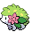

### Grass

| Sprite | Pokémon | Encounter Type | Chance |
| :---: | --- | :---: | --- |
|  | [Exeggcute](../pokemon/exeggcute.md/) | {: style='max-width: 24px;' } | 20% |
|  | [Bibarel](../pokemon/bibarel.md/) | {: style='max-width: 24px;' } | 20% |
|  | [Zangoose](../pokemon/zangoose.md/) | {: style='max-width: 24px;' } | 10% |
|  | [Seviper](../pokemon/seviper.md/) | {: style='max-width: 24px;' } | 10% |
|  | [Volbeat](../pokemon/volbeat.md/) | {: style='max-width: 24px;' } | 10% |
|  | [Illumise](../pokemon/illumise.md/) | {: style='max-width: 24px;' } | 10% |
|  | [Farfetch'd](../pokemon/farfetchd.md/) | {: style='max-width: 24px;' } | 10% |
|  | [Chatot](../pokemon/chatot.md/) | {: style='max-width: 24px;' } | 10%

### Dark Grass

| Sprite | Pokémon | Encounter Type | Chance |
| :---: | --- | :---: | --- |
|  | [Flaaffy](../pokemon/flaaffy.md/) | {: style='max-width: 24px;' } | 20% |
|  | [Kadabra](../pokemon/kadabra.md/) | {: style='max-width: 24px;' } | 20% |
|  | [Lombre](../pokemon/lombre.md/) | {: style='max-width: 24px;' } | 20% |
|  | [Nuzleaf](../pokemon/nuzleaf.md/) | {: style='max-width: 24px;' } | 20% |
|  | [Roselia](../pokemon/roselia.md/) | {: style='max-width: 24px;' } | 10% |
|  | [Togepi](../pokemon/togepi.md/) | {: style='max-width: 24px;' } | 10%

### Rustling Grass

| Sprite | Pokémon | Encounter Type | Chance |
| :---: | --- | :---: | --- |
|  | [Chansey](../pokemon/chansey.md/) | {: style='max-width: 24px;' } | 75% |
|  | [Emolga](../pokemon/emolga.md/) | {: style='max-width: 24px;' } | 10% |
|  | [Togetic](../pokemon/togetic.md/) | {: style='max-width: 24px;' } | 5% |
|  | [Exeggutor](../pokemon/exeggutor.md/) | {: style='max-width: 24px;' } | 5% |
|  | [Roserade](../pokemon/roserade.md/) | {: style='max-width: 24px;' } | 5%

### Surfing

| Sprite | Pokémon | Encounter Type | Chance |
| :---: | --- | :---: | --- |
|  | [Tentacruel](../pokemon/tentacruel.md/) | {: style='max-width: 24px;' } | 60% |
|  | [Sharpedo](../pokemon/sharpedo.md/) | {: style='max-width: 24px;' } | 40%

### Rippling Surfing

| Sprite | Pokémon | Encounter Type | Chance |
| :---: | --- | :---: | --- |
|  | [Sharpedo](../pokemon/sharpedo.md/) | {: style='max-width: 24px;' } | 60% |
|  | [Jellicent](../pokemon/jellicent.md/) | {: style='max-width: 24px;' } | 40%

### Fishing

| Sprite | Pokémon | Encounter Type | Chance |
| :---: | --- | :---: | --- |
|  | [Carvanha](../pokemon/carvanha.md/) | {: style='max-width: 24px;' } | 70% |
|  | [Basculin](../pokemon/basculin-red-striped.md/) | {: style='max-width: 24px;' } | 30%

### Rippling Fishing

| Sprite | Pokémon | Encounter Type | Chance |
| :---: | --- | :---: | --- |
|  | [Carvanha](../pokemon/carvanha.md/) | {: style='max-width: 24px;' } | 60% |
|  | [Basculin](../pokemon/basculin-red-striped.md/) | {: style='max-width: 24px;' } | 30% |
|  | [Sharpedo](../pokemon/sharpedo.md/) | {: style='max-width: 24px;' } | 10% |

### Legendary Encounter

| Sprite | Pokémon | Level | Encounter Type | Location | Chance |
| :---: | --- | --- | :---: | --- | --- |
|  | Shaymin | Level 50 | {: style='max-width: 24px;' } | Village Bridge | 1% |

### Legendary Encounter

| Sprite | Pokémon | Level | Encounter Type | Location | Chance |
| :---: | --- | --- | :---: | --- | --- |
|  | Meloetta | Level 50 | {: style='max-width: 24px;' } | Village Bridge | 1% |
