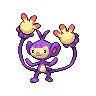

---

## Scientist Lenora

**Battle Type:** Single Battle

| Pokemon | Attributes | Moves |
|:-------:|------------|-------|
|  |**Lv. 87** [Stoutland](../../pokemon/stoutland.md/) **Item:** Air Balloon **Ability:** Intimidate | 1: Return 2: Crunch 3: Fire Fang 4: Wild Charge |
|  |**Lv. 87** [Granbull](../../pokemon/granbull.md/) **Item:** Chople Berry **Ability:** Intimidate | 1: Thunder Wave 2: Return 3: Earthquake 4: Crunch |
|  |**Lv. 87** [Kangaskhan](../../pokemon/kangaskhan.md/) **Item:** Expert Belt **Ability:** Scrappy | 1: Outrage 2: Return 3: Earthquake 4: Sucker Punch |
|  |**Lv. 87** [Ambipom](../../pokemon/ambipom.md/) **Item:** Scope Lens **Ability:** Technician | 1: Double Hit 2: Fake Out 3: Low Kick 4: U-turn |
|  |**Lv. 87** [Watchog](../../pokemon/watchog.md/) **Item:** Air Balloon **Ability:** Analytic | 1: Super Fang 2: Crunch 3: Low Kick 4: Thunder Wave |
|  |**Lv. 89** [Bouffalant](../../pokemon/bouffalant.md/) **Item:** Sitrus Berry **Ability:** Reckless | 1: Head Charge 2: Wild Charge 3: Stone Edge 4: Earthquake |

