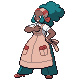
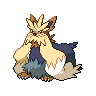

---

## Scientist Lenora

| Pokemon | Attributes | Moves |
|:-------:|------------|-------|
|  |**Lv. 87** [Stoutland](../../pokemon/stoutland.md/) **Item:** Air Balloon **Ability:** Intimidate | 1. Return 2. Crunch 3. Fire Fang 4. Wild Charge |
|  |**Lv. 87** [Granbull](../../pokemon/granbull.md/) **Item:** Chople Berry **Ability:** Intimidate | 1. Thunder Wave 2. Return 3. Earthquake 4. Crunch |
|  |**Lv. 87** [Kangaskhan](../../pokemon/kangaskhan.md/) **Item:** Expert Belt **Ability:** Scrappy | 1. Outrage 2. Return 3. Earthquake 4. Sucker Punch |
|  |**Lv. 87** [Ambipom](../../pokemon/ambipom.md/) **Item:** Scope Lens **Ability:** Technician | 1. Double Hit 2. Fake Out 3. Low Kick 4. U-turn |
|  |**Lv. 87** [Watchog](../../pokemon/watchog.md/) **Item:** Air Balloon **Ability:** Analytic | 1. Super Fang 2. Crunch 3. Low Kick 4. Thunder Wave |
|  |**Lv. 89** [Bouffalant](../../pokemon/bouffalant.md/) **Item:** Sitrus Berry **Ability:** Reckless | 1. Head Charge 2. Wild Charge 3. Stone Edge 4. Earthquake |

