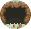
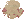

---

## Wellspring Cave – 1F

### Cave, Normal

| Sprite | Pokémon | Encounter Type | Chance |
| :---: | --- | :---: | --- |
|  | [Woobat](../pokemon/woobat.md/) | {: style='max-width: 24px;' } | 20% |
|  | [Zubat](../pokemon/zubat.md/) | {: style='max-width: 24px;' } | 20% |
|  | [Geodude](../pokemon/geodude.md/) | {: style='max-width: 24px;' } | 10% |
|  | [Roggenrola](../pokemon/roggenrola.md/) | {: style='max-width: 24px;' } | 10% |
|  | [Aron](../pokemon/aron.md/) | {: style='max-width: 24px;' } | 10% |
|  | [Whismur](../pokemon/whismur.md/) | {: style='max-width: 24px;' } | 10% |
|  | [Wooper](../pokemon/wooper.md/) | {: style='max-width: 24px;' } | 5% |
|  | [Bronzor](../pokemon/bronzor.md/) | {: style='max-width: 24px;' } | 5% |
|  | [Axew](../pokemon/axew.md/) | {: style='max-width: 24px;' } | 5% |
|  | [Teddiursa](../pokemon/teddiursa.md/) | {: style='max-width: 24px;' } | 5%

### Cave, Special

| Sprite | Pokémon | Encounter Type | Chance |
| :---: | --- | :---: | --- |
|  | [Drilbur](../pokemon/drilbur.md/) | {: style='max-width: 24px;' } | 40% |
|  | [Diglett](../pokemon/diglett.md/) | {: style='max-width: 24px;' } | 40% |
|  | [Gible](../pokemon/gible.md/) | {: style='max-width: 24px;' } | 20%

### Surf, Normal

| Sprite | Pokémon | Encounter Type | Chance |
| :---: | --- | :---: | --- |
|  | [Wooper](../pokemon/wooper.md/) | {: style='max-width: 24px;' } | 60% |
|  | [Shellos](../pokemon/shellos.md/) | {: style='max-width: 24px;' } | 40%

### Surf, Special

| Sprite | Pokémon | Encounter Type | Chance |
| :---: | --- | :---: | --- |
|  | [Quagsire](../pokemon/quagsire.md/) | {: style='max-width: 24px;' } | 60% |
|  | [Gastrodon](../pokemon/gastrodon.md/) | {: style='max-width: 24px;' } | 40%

### Fish, Normal

| Sprite | Pokémon | Encounter Type | Chance |
| :---: | --- | :---: | --- |
|  | [Barboach](../pokemon/barboach.md/) | {: style='max-width: 24px;' } | 60% |
|  | [Tentacool](../pokemon/tentacool.md/) | {: style='max-width: 24px;' } | 30% |
|  | [Shellder](../pokemon/shellder.md/) | {: style='max-width: 24px;' } | 10%

### Fish, Special

| Sprite | Pokémon | Encounter Type | Chance |
| :---: | --- | :---: | --- |
|  | [Shellder](../pokemon/shellder.md/) | {: style='max-width: 24px;' } | 100%

---

## Wellspring Cave – B1F

### Cave, Normal

| Sprite | Pokémon | Encounter Type | Chance |
| :---: | --- | :---: | --- |
|  | [Woobat](../pokemon/woobat.md/) | {: style='max-width: 24px;' } | 20% |
|  | [Golbat](../pokemon/golbat.md/) | {: style='max-width: 24px;' } | 20% |
|  | [Graveler](../pokemon/graveler.md/) | {: style='max-width: 24px;' } | 10% |
|  | [Boldore](../pokemon/boldore.md/) | {: style='max-width: 24px;' } | 10% |
|  | [Lairon](../pokemon/lairon.md/) | {: style='max-width: 24px;' } | 10% |
|  | [Steelix](../pokemon/steelix.md/) | {: style='max-width: 24px;' } | 10% |
|  | [Loudred](../pokemon/loudred.md/) | {: style='max-width: 24px;' } | 10% |
|  | [Quagsire](../pokemon/quagsire.md/) | {: style='max-width: 24px;' } | 10%

### Cave, Special

| Sprite | Pokémon | Encounter Type | Chance |
| :---: | --- | :---: | --- |
|  | [Excadrill](../pokemon/excadrill.md/) | {: style='max-width: 24px;' } | 50% |
|  | [Dugtrio](../pokemon/dugtrio.md/) | {: style='max-width: 24px;' } | 50%

### Surf, Normal

| Sprite | Pokémon | Encounter Type | Chance |
| :---: | --- | :---: | --- |
|  | [Whiscash](../pokemon/whiscash.md/) | {: style='max-width: 24px;' } | 60% |
|  | [Gastrodon](../pokemon/gastrodon.md/) | {: style='max-width: 24px;' } | 40%

### Surf, Special

| Sprite | Pokémon | Encounter Type | Chance |
| :---: | --- | :---: | --- |
|  | [Whiscash](../pokemon/whiscash.md/) | {: style='max-width: 24px;' } | 60% |
|  | [Gastrodon](../pokemon/gastrodon.md/) | {: style='max-width: 24px;' } | 40%

### Fish, Normal

| Sprite | Pokémon | Encounter Type | Chance |
| :---: | --- | :---: | --- |
|  | [Whiscash](../pokemon/whiscash.md/) | {: style='max-width: 24px;' } | 100%

### Fish, Special

| Sprite | Pokémon | Encounter Type | Chance |
| :---: | --- | :---: | --- |
|  | [Cloyster](../pokemon/cloyster.md/) | {: style='max-width: 24px;' } | 100% |
