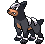

# Wellspring Cave – Trainer Rosters

---

## Generic Trainers</h3>

| Trainer | P1 | P2 | P3 | P4 | P5 | P6 |
|:-------:|:--:|:--:|:--:|:--:|:--:|:--:|
|  Plasma Grunt |  [Zubat](../../pokemon/zubat.md/) Lv. 15 |  [Tentacool](../../pokemon/tentacool.md/) Lv. 15 |  [Poochyena](../../pokemon/poochyena.md/) Lv. 15 |
|  Plasma Grunt |  [Voltorb](../../pokemon/voltorb.md/) Lv. 15 |  [Carvanha](../../pokemon/carvanha.md/) Lv. 15 |  [Pawniard](../../pokemon/pawniard.md/) Lv. 15 |
|  Plasma Grunt |  [Gulpin](../../pokemon/gulpin.md/) Lv. 15 |  [Numel](../../pokemon/numel.md/) Lv. 15 |  [Houndour](../../pokemon/houndour.md/) Lv. 15 |

