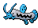

---

## Wellspring Cave – 1F

### Cave

| Sprite | Pokémon | Encounter Type | Chance |
| :---: | --- | :---: | --- |
|  | [Woobat](../../pokemon/woobat.md/) | {: style='max-width: 24px;' } | 20% |
|  | [Zubat](../../pokemon/zubat.md/) | {: style='max-width: 24px;' } | 20% |
|  | [Geodude](../../pokemon/geodude.md/) | {: style='max-width: 24px;' } | 10% |
|  | [Roggenrola](../../pokemon/roggenrola.md/) | {: style='max-width: 24px;' } | 10% |
|  | [Aron](../../pokemon/aron.md/) | {: style='max-width: 24px;' } | 10% |
|  | [Whismur](../../pokemon/whismur.md/) | {: style='max-width: 24px;' } | 10% |
|  | [Wooper](../../pokemon/wooper.md/) | {: style='max-width: 24px;' } | 5% |
|  | [Bronzor](../../pokemon/bronzor.md/) | {: style='max-width: 24px;' } | 5% |
|  | [Axew](../../pokemon/axew.md/) | {: style='max-width: 24px;' } | 5% |
|  | [Teddiursa](../../pokemon/teddiursa.md/) | {: style='max-width: 24px;' } | 5%

### Dust Cloud

| Sprite | Pokémon | Encounter Type | Chance |
| :---: | --- | :---: | --- |
|  | [Drilbur](../../pokemon/drilbur.md/) | {: style='max-width: 24px;' } | 40% |
|  | [Diglett](../../pokemon/diglett.md/) | {: style='max-width: 24px;' } | 40% |
|  | [Gible](../../pokemon/gible.md/) | {: style='max-width: 24px;' } | 20%

### Surfing

| Sprite | Pokémon | Encounter Type | Chance |
| :---: | --- | :---: | --- |
|  | [Wooper](../../pokemon/wooper.md/) | {: style='max-width: 24px;' } | 60% |
|  | [Shellos](../../pokemon/shellos.md/) | {: style='max-width: 24px;' } | 40%

### Rippling Surfing

| Sprite | Pokémon | Encounter Type | Chance |
| :---: | --- | :---: | --- |
|  | [Quagsire](../../pokemon/quagsire.md/) | {: style='max-width: 24px;' } | 60% |
|  | [Gastrodon](../../pokemon/gastrodon.md/) | {: style='max-width: 24px;' } | 40%

### Fishing

| Sprite | Pokémon | Encounter Type | Chance |
| :---: | --- | :---: | --- |
|  | [Barboach](../../pokemon/barboach.md/) | {: style='max-width: 24px;' } | 60% |
|  | [Tentacool](../../pokemon/tentacool.md/) | {: style='max-width: 24px;' } | 30% |
|  | [Shellder](../../pokemon/shellder.md/) | {: style='max-width: 24px;' } | 10%

### Rippling Fishing

| Sprite | Pokémon | Encounter Type | Chance |
| :---: | --- | :---: | --- |
|  | [Shellder](../../pokemon/shellder.md/) | {: style='max-width: 24px;' } | 100%

---

## Wellspring Cave – B1F

### Cave

| Sprite | Pokémon | Encounter Type | Chance |
| :---: | --- | :---: | --- |
|  | [Woobat](../../pokemon/woobat.md/) | {: style='max-width: 24px;' } | 20% |
|  | [Golbat](../../pokemon/golbat.md/) | {: style='max-width: 24px;' } | 20% |
|  | [Graveler](../../pokemon/graveler.md/) | {: style='max-width: 24px;' } | 10% |
|  | [Boldore](../../pokemon/boldore.md/) | {: style='max-width: 24px;' } | 10% |
|  | [Lairon](../../pokemon/lairon.md/) | {: style='max-width: 24px;' } | 10% |
|  | [Steelix](../../pokemon/steelix.md/) | {: style='max-width: 24px;' } | 10% |
|  | [Loudred](../../pokemon/loudred.md/) | {: style='max-width: 24px;' } | 10% |
|  | [Quagsire](../../pokemon/quagsire.md/) | {: style='max-width: 24px;' } | 10%

### Dust Cloud

| Sprite | Pokémon | Encounter Type | Chance |
| :---: | --- | :---: | --- |
|  | [Excadrill](../../pokemon/excadrill.md/) | {: style='max-width: 24px;' } | 50% |
|  | [Dugtrio](../../pokemon/dugtrio.md/) | {: style='max-width: 24px;' } | 50%

### Surfing

| Sprite | Pokémon | Encounter Type | Chance |
| :---: | --- | :---: | --- |
|  | [Whiscash](../../pokemon/whiscash.md/) | {: style='max-width: 24px;' } | 60% |
|  | [Gastrodon](../../pokemon/gastrodon.md/) | {: style='max-width: 24px;' } | 40%

### Rippling Surfing

| Sprite | Pokémon | Encounter Type | Chance |
| :---: | --- | :---: | --- |
|  | [Whiscash](../../pokemon/whiscash.md/) | {: style='max-width: 24px;' } | 60% |
|  | [Gastrodon](../../pokemon/gastrodon.md/) | {: style='max-width: 24px;' } | 40%

### Fishing

| Sprite | Pokémon | Encounter Type | Chance |
| :---: | --- | :---: | --- |
|  | [Whiscash](../../pokemon/whiscash.md/) | {: style='max-width: 24px;' } | 100%

### Rippling Fishing

| Sprite | Pokémon | Encounter Type | Chance |
| :---: | --- | :---: | --- |
|  | [Cloyster](../../pokemon/cloyster.md/) | {: style='max-width: 24px;' } | 100% |
